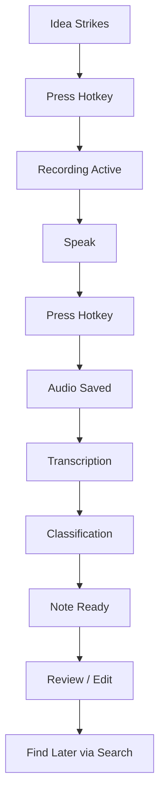

# NoteWeave — PRD

## 1. Document Control

### 1.1 Metadata

| Field | Value |
|---|---|
| **Product Name** | NoteWeave |
| **Product Version** | 1.0.0 |
| **PRD Version** | 1.0 |
| **Status** | Draft |
| **Author** | Hermes Agent (Cron Job) |
| **Stakeholders** | Product Owner, Engineering Team, Design Team, QA |
| **Created Date** | 2026-06-07 |
| **Last Updated** | 2026-06-07 |
| **Approvers** | TBD |

### 1.2 Revision History

| Version | Date | Author | Changes |
|---|---|---|---|
| 1.0 | 2026-06-07 | Hermes Agent | Initial draft |

---

## 2. Executive Summary

### 2.1 Product Vision

NoteWeave is a voice-first AI note capture app that runs on your desktop, listens passively, and automatically organizes everything you say into searchable, structured notes. Unlike voice memos that become graveyard of audio files, NoteWeave transforms spoken words into actionable knowledge with zero friction.

### 2.2 Problem Statement

Great ideas come at inconvenient moments — while commuting, showering, cooking. Current solutions require friction: unlock phone, open app, hit record. By the time you're ready, the idea is gone. Even when you do capture audio, it becomes an unsearchable file graveyard. People capture 3x more voice notes than they ever review.

### 2.3 Proposed Solution

A desktop app that runs in the background with a single hotkey, captures voice notes with zero friction, transcribes locally with AI, structures notes automatically (action items, decisions, ideas), and keeps everything searchable with natural language.

### 2.4 Business Value

- **Time savings**: 30 min/week of captured but lost ideas become recovered
- **Revenue model**: Freemium (100 notes/mo free, Pro at $7.99/mo unlimited)
- **Market opportunity**: Voice memos are a $1.2B market, voice AI is $30B+ growing at 25% CAGR
- **Differentiation**: "The second brain for people who think out loud"

### 2.5 Success Definition

- 15,000 active users within 6 months
- Average notes captured per user: 5/week
- Review rate: > 60% of notes reviewed (vs industry avg of 15%)
- NPS score > 50

---

## 3. Strategic Context

### 3.1 Market Analysis

**Market Size**
- **TAM**: $1.2B (voice memo/note-taking apps)
- **SAM**: $400M (AI-powered note organization)
- **SOM**: $30M (first year revenue potential)

**Growth Trends**
- Voice AI market growing at 25% CAGR
- "Thinking out loud" productivity trend accelerating
- Local AI transcription making privacy-first products viable

**Industry Drivers**
- Whisper/OpenAI making transcription cheap and accurate
- LLMs making note structuring automatic
- Privacy concerns pushing local processing

**Threats**
- Apple/Google built-in voice memos adding AI features
- Otter.ai expanding from meetings to personal notes
- Notion AI adding voice capture

### 3.2 Competitor Analysis

| Competitor | Strength | Weakness |
|---|---|---|
| Otter.ai | Transcription accuracy, meeting focus | Cloud-only, complex for personal notes |
| Apple Voice Memos | Built-in, zero friction | No AI organization, no search |
| Sony | Simple, cross-platform | No AI, no organization |
| Rev | Human transcription quality | Expensive, not smart |
| Gnote / Samsung Voice | Mobile only | No desktop, limited AI |

### 3.3 Product Positioning

"Think out loud. We handle the rest."

### 3.4 Differentiators

1. **Desktop-first** — Runs in background on Mac/Windows
2. **Zero-friction capture** — One hotkey from anywhere
3. **Auto-structuring** — Notes automatically organized (action items, decisions, ideas)
4. **Local AI** — All transcription on-device, no cloud
5. **Semantic search** — Find anything by describing it, not by keyword

---

## 4. Goals & Objectives

### Business Goals
- $75K ARR within 12 months
- 20,000 registered users, 15,000 MAU
- 8% free-to-paid conversion rate

### User Goals
- Capture ideas without friction
- Never lose a thought again
- Find past notes instantly
- Turn voice notes into actionable items

### Technical Goals
- Transcription latency < 3 seconds for 1-minute audio
- App startup < 1 second (background agent)
- < 1% CPU when idle
- Search latency < 100ms

---

## 5. Personas

### 5.1 Primary Persona: Busy Professional — Jordan

| Field | Value |
|---|---|
| **Name** | Jordan, 35, Management Consultant |
| **Demographics** | Urban, $150K salary, MacBook user |
| **Background** | 10 years in consulting, constant travel, 200+ meetings/year |
| **Goals** | Capture insights on-the-fly, never miss action items, stay organized |
| **Pain Points** | Ideas lost between meetings, action items scattered across emails |
| **Motivations** | Career performance, being reliable |
| **Success Metrics** | Captures 10+ notes/week, reviews 80%, finds 90% when needed |
| **Technology Usage** | Heavy: email, Slack, calendar, PowerPoint |

### 5.2 Secondary Persona: Creator — Sam

| Field | Value |
|---|---|
| **Name** | Sam, 27, YouTube Content Creator |
| **Demographics** | $60K income, Windows desktop + mobile |
| **Background** | 3 years creating, scripts ideas as voice notes |
| **Goals** | Script ideas captured quickly, organized by project/episode |
| **Pain Points** | Audio files unorganized, can't find past ideas, transcription takes too long |
| **Motivations** | Creative expression, audience growth |
| **Success Metrics** | Captures 15+ notes/week, organized by project |
| **Technology Usage** | YouTube, OBS, Audacity, Google Docs |

---

## 6. User Research

### 6.1 Key Findings

1. **"I have 400 voice memos I've never listened to"** — Industry standard problem
2. **Friction is the enemy** — If it takes > 3 seconds to start recording, idea is lost
3. **Search is broken** — Audio files can't be searched, so they become graveyard
4. **Structure is the value** — Users don't want audio, they want "what action item did I capture?"
5. **Privacy is essential** — "I say client names in my notes, can't have that in the cloud"

### 6.2 Insights

- The value is not in capture but in retrieval
- Auto-structuring (action items, decisions, ideas) is the killer feature
- Background operation with global hotkey is the UX differentiator
- Local transcription removes the last privacy objection

---

## 7. Scope Definition

### 7.1 In Scope

- Global hotkey voice capture (Cmd+Shift+N)
- Local AI transcription (Whisper-based)
- Auto-structuring (action items, decisions, ideas, general notes)
- Semantic search across all notes
- Note organization (folders, tags, projects)
- Background operation (system tray)
- macOS + Windows support

### 7.2 Out of Scope

- Real-time transcription during calls (separate product)
- Cloud sync (all local)
- Team collaboration
- Mobile companion app (Phase 2)
- Meeting recording (covered by existing products)
- Video notes (Phase 3)

### 7.3 Future Scope

- Mobile companion app
- Team shared notebooks
- Calendar integration (link notes to meetings)
- Voice command ("find notes about X")

---

## 8. User Journey

### 8.1 End-to-End Journey

```
User hears a great idea
→ Doesn't reach for phone
→ Presses Cmd+Shift+N (from any app)
→ Speaks idea (1 second to start)
→ Hears confirmation beep
→ Continues with day (10-60 seconds later)
→ Note appears in NoteWeave: transcribed, structured, searchable

Later: "What did I say about that brand positioning?"
→ Opens NoteWeave → searches natural language
→ Finds exact note with context
→ Reviews, edits, shares if needed
```

### 8.2 Journey Map

| Stage | User Action | System Response | Emotion |
|---|---|---|---|
| Awareness | See in Product Hunt | Landing page with demo | Curious |
| Discovery | Download + install | Setup wizard | Excited |
| Signup | First hotkey use | "Start capturing" prompt | Neutral |
| Activation | First note captured | "Great! Your note is ready" | Amazed |
| Usage | Daily hotkey usage | Notes auto-organized | Satisfied |
| Retention | Search + find past note | "This works" moment | Proud |
| Advocacy | Tell colleague | Community grows | Loyal |

---

## 9. Functional Requirements

### FR-001: Global Hotkey Capture

**Title**: One-key voice capture from anywhere

**Description**: A global hotkey (Cmd+Shift+N) that instantly starts recording voice from any application, even when NoteWeave is in the background.

**User Story**:
> As a user, I want to capture a voice note from within any app with a single keystroke so that I never lose an idea due to friction.

**Acceptance Criteria**:
- [ ] Hotkey works even when NoteWeave is not focused
- [ ] Recording starts within 200ms of hotkey press
- [ ] Audio captured via system microphone
- [ ] Visual + audio confirmation when recording starts
- [ ] Second hotkey press stops and processes note
- [ ] Works from any application (browser, IDE, Slack, etc.)

**Business Rules**:
- Default hotkey: Cmd+Shift+N (Mac) / Ctrl+Shift+N (Win)
- Minimum recording: 1 second
- Maximum recording: 30 minutes (configurable)
- Auto-stop after 30s of silence (optional)

**Dependencies**: None

**Priority**: Must

---

### FR-002: Local AI Transcription

**Title**: On-device speech-to-text

**Description**: Recorded audio is transcribed locally using a Whisper-based model, ensuring complete privacy and no latency from network calls.

**User Story**:
> As a user, I want my voice notes transcribed on my device so that my private conversations never leave my computer.

**Acceptance Criteria**:
- [ ] Transcription accuracy > 95% for clear English speech
- [ ] Transcription latency < 3 seconds for 1-minute audio
- [ ] No audio data sent to any external service
- [ ] Supports English (Phase 1), multi-language (Phase 2)
- [ ] Timestamps captured for each phrase

**Business Rules**:
- Model: Whisper Tiny (fast, local) or Medium (higher accuracy, optional)
- Storage: Original audio kept for 7 days (configurable)
- Fallback: Cloud transcription only if local fails (with user consent)

**Dependencies**: FR-001

**Priority**: Must

---

### FR-003: Auto-Structuring

**Title**: AI-powered note categorization

**Description**: Transcribed text is automatically classified into categories: Action Item, Decision, Idea, Meeting Note, Personal, Question.

**User Story**:
> As a user, I want my notes automatically organized so that I can find them by type without manually tagging.

**Acceptance Criteria**:
- [ ] Classification accuracy > 85%
- [ ] Categories: Action Item, Decision, Idea, Meeting Note, Personal, Question
- [ ] Extracted entities: People names, dates, tasks
- [ ] Confidence score shown per classification
- [ ] User can override classification with one click

**Business Rules**:
- Action Items: Detected via "need to", "must", "should", "action", task patterns
- Decisions: Detected via "decided", "will", "going to", "choice" patterns
- Ideas: Free-form thought patterns
- Meeting Notes: "We discussed", "meeting", "client said" patterns

**Dependencies**: FR-002

**Priority**: Must

---

### FR-004: Semantic Search

**Title**: Natural language note retrieval

**Description**: All notes are indexed locally and searchable using natural language queries. "What did I say about project timeline?" returns relevant notes.

**User Story**:
> As a user, I want to search my notes by describing what I'm looking for so that I don't need to remember exact words.

**Acceptance Criteria**:
- [ ] Search returns results within 100ms
- [ ] Results show transcribed text + timestamp + category
- [ ] Click to expand full note
- [ ] Filter by category, date range, project
- [ ] Ranked by relevance + recency

**Business Rules**:
- Index stored in SQLite + vector embeddings
- Maximum 10,000 notes indexed (pagination for more)
- Search history saved for quick access

**Dependencies**: FR-002, FR-003

**Priority**: Must

---

### FR-005: Organization System

**Title**: Folders, tags, and projects

**Description**: Notes can be organized into folders, tagged with custom labels, and grouped into projects for longer-term organization.

**User Story**:
> As a user, I want to organize my notes by project so that I can find all related notes together.

**Acceptance Criteria**:
- [ ] Create folders (e.g., "Work", "Personal", "Podcast")
- [ ] Create tags (e.g., #urgent, #client-x, #research)
- [ ] Create projects with multiple notes
- [ ] Drag-and-drop notes between folders
- [ ] Bulk actions (move, delete, export multiple notes)

**Business Rules**:
- Folder hierarchy: 1 level deep
- Maximum tags per note: 10
- Project notes sorted by date

**Dependencies**: FR-002

**Priority**: Should

---

## 10. Feature Specifications

### Feature: Hotkey Capture

| Field | Value |
|---|---|
| **Purpose** | Enable zero-friction note capture from any app |
| **Value** | This is the core differentiator — frictionless capture |
| **Owner** | Product |
| **Priority** | Must |

**User Stories**:
1. "I'm in a meeting and have an idea — press hotkey, speak, done"
2. "I'm cooking and remember something — press hotkey from anywhere"
3. "I'm on a call and don't want to interrupt — capture after"

**Detailed Workflow**:
```
1. User presses Cmd+Shift+N
2. System captures audio stream
3. Visual indicator shows recording (menu bar icon pulse)
4. User speaks
5. User presses Cmd+Shift+N again (or auto-stop after silence)
6. Audio saved locally
7. Transcription starts (local AI)
8. Classification runs
9. Note appears in list (typically < 5 seconds total)
10. User receives notification: "Note captured: [preview]"
```

**Inputs**: Audio stream from system microphone

**Outputs**: Transcribed text, category, timestamp, audio file

**Error Handling**:
- Microphone not available: Show alert, open system preferences
- Recording fails: Save partial if possible, warn user
- Transcription fails: Save audio, retry transcription later

**Edge Cases**:
- Very short recording (< 1s): Discard as accidental
- Very long recording (> 30min): Auto-stop with warning
- No speech detected: Show "No speech detected, try again"
- Background noise: Accept, AI handles it

**Validation Rules**: Audio must be > 1 second and > 50% speech

**Permissions**: Microphone access, global hotkey registration

**Dependencies**: None

---

## 11. User Flows

### Happy Path: Capture a Note

```
[Idea strikes] → [Press Cmd+Shift+N]
                        ↓
                  [Recording starts - icon pulses]
                        ↓
                  [Speak idea]
                        ↓
                  [Press Cmd+Shift+N to stop]
                        ↓
                  [Processing... 2-5 seconds]
                        ↓
                  [Note appears: "Decided to change brand voice to be more playful"]
                        ↓
                  [Category: Decision, confidence: 92%]
                        ↓
                  [User reviews, edits if needed]
```

### Mermaid Diagram



---

## 12. Screen Requirements

### Screen 1: Notes List (Main View)

| Field | Value |
|---|---|
| **Purpose** | Primary interface showing all notes |
| **Entry Points** | App launch, tray click |
| **Exit Points** | Escape, minimize |

**Components**:
- Search bar (top)
- Filter tabs (All, Action, Decision, Idea, Meeting, Personal)
- Notes list (chronological, newest first)
- Note card: Preview text, category badge, timestamp
- FAB (floating action button): New note via hotkey hint

**States**:
- Empty: "Press Cmd+Shift+N to capture your first note"
- Loading: Skeleton cards
- Populated: Note list
- Searching: Filtered results

---

### Screen 2: Note Detail

| Field | Value |
|---|---|
| **Purpose** | View/edit single note |
| **Entry Points** | Click note card |
| **Exit Points** | Back, Escape |

**Components**:
- Full transcribed text (editable)
- Category selector (chips)
- Tags input
- Folder/Project assignment
- Audio playback (original recording)
- Timestamps
- Edit/Delete buttons

**States**:
- Viewing
- Editing
- Playing audio

---

### Screen 3: Search Results

| Field | Value |
|---|---|
| **Purpose** | Display search results |
| **Entry Points** | Type in search bar |
| **Exit Points** | Clear search, Escape |

**Components**:
- Search query displayed
- Results count
- Result cards (text match highlighted)
- Filters (date, category)

---

## 13. UX Requirements

### Usability Principles
- Capture first, organize later
- Keyboard-driven (hotkey is primary interaction)
- Minimal clicks to find anything

### Accessibility
- WCAG 2.1 AA
- Full keyboard navigation
- VoiceOver / Narrator support

### Desktop UX
- System tray always running
- Global hotkey works system-wide
- Proper macOS/Windows conventions

---

## 14. Design System Requirements

### Colors
- Primary: #6C5CE7 (purple — creativity, voice)
- Background: #FAFAFA (light) / #1A1A2E (dark)
- Surface: #FFFFFF / #16213E
- Action: #E17055 (coral — urgency for action items)
- Decision: #00B894 (teal)
- Idea: #FDCB6E (yellow)
- Text: #2D3436 / #DFE6E9

### Typography
- Font: Inter
- H1: 24px, Bold
- H2: 18px, Semibold
- Body: 15px, Regular
- Caption: 12px, Regular

---

## 15. Information Architecture

```
App Window
├── Notes List (default)
│   ├── Search
│   └── Filter Tabs
├── Note Detail (overlay)
└── Settings (menu)

System Tray
├── Open NoteWeave
├── New Note (trigger hotkey)
├── Recent Notes →
└── Quit
```

---

## 16. Data Requirements

### Entities

**Note**
| Attribute | Type | Description |
|---|---|---|
| id | UUID | Primary key |
| created_at | DateTime | Capture time |
| updated_at | DateTime | Last edit |
| transcribed_text | String | Full transcript |
| category | Enum | Action, Decision, Idea, Meeting, Personal, Question |
| category_confidence | Float | AI confidence 0-1 |
| folder_id | UUID | FK to folder |
| tags | String[] | Array of tag strings |
| audio_path | String | Path to original audio |
| is_reviewed | Boolean | User has viewed |

**Folder**
| Attribute | Type | Description |
|---|---|---|
| id | UUID | Primary key |
| name | String | Folder name |
| created_at | DateTime | Creation time |
| sort_order | Integer | User-defined order |

**Tag**
| Attribute | Type | Description |
|---|---|---|
| id | UUID | Primary key |
| name | String | Tag name |
| color | String | Hex color |

---

## 17. Database Design

### SQLite Schema

```sql
CREATE TABLE notes (
    id TEXT PRIMARY KEY,
    created_at DATETIME,
    updated_at DATETIME,
    transcribed_text TEXT,
    category TEXT,
    category_confidence REAL,
    folder_id TEXT,
    audio_path TEXT,
    is_reviewed INTEGER DEFAULT 0,
    FOREIGN KEY (folder_id) REFERENCES folders(id)
);

CREATE TABLE folders (
    id TEXT PRIMARY KEY,
    name TEXT,
    created_at DATETIME,
    sort_order INTEGER
);

CREATE TABLE tags (
    id TEXT PRIMARY KEY,
    name TEXT UNIQUE,
    color TEXT
);

CREATE TABLE note_tags (
    note_id TEXT,
    tag_id TEXT,
    PRIMARY KEY (note_id, tag_id)
);

CREATE INDEX idx_notes_created ON notes(created_at DESC);
CREATE INDEX idx_notes_category ON notes(category);
```

---

## 18. API Requirements

N/A — Fully local desktop application.

---

## 19. AI Requirements

### Models Used
| Model | Purpose | Size | Location |
|---|---|---|---|
| Whisper Tiny | Transcription | ~75MB | Local |
| DistilBERT | Classification | ~250MB | Local |

### AI Workflow
```
Audio captured
    → Save to .m4a
    → Whisper Tiny transcription
    → DistilBERT classification
    → Named entity extraction (simple regex + heuristics)
    → Store in SQLite
    → Generate embedding for search
```

### Verification
- Transcription accuracy: Spot check 5% of notes monthly
- Classification accuracy: User feedback tracked per note

### Hallucination Controls
- No generative AI — retrieval + classification only
- Classification confidence shown to manage expectations

---

## 20. Security Requirements

### Authentication
- Local app — no user auth
- System-level mic permission

### Authorization
- App data in sandboxed directory
- No cross-app access

### Encryption
- All data local
- Optional: FileVault/BitLocker protection

### Secrets
- No external API keys

### Compliance
- GDPR: All data local, deletable
- CCPA: Configurable retention

---

## 21. Privacy Requirements

### Data Collection
- Voice audio only (no screen, no keystrokes)
- Audio stored locally for 7 days (configurable)
- Transcription stored permanently (until user deletes)

### Consent
- First launch: Microphone permission explanation
- Recording indicator always visible when active

### Data Deletion
- Delete individual notes
- Bulk delete by folder/date
- "Delete all data" option

---

## 22. Performance Requirements

| Metric | Target |
|---|---|
| Hotkey → recording start | < 200ms |
| Transcription latency | < 3s per minute of audio |
| Search latency | < 100ms |
| App idle CPU | < 1% |
| App idle RAM | < 100MB |
| Note appears in list | < 5s total |

---

## 23. Reliability Requirements

- Recording continues if transcription backend fails
- Auto-retry failed transcriptions
- No data loss on crash (audio saved before processing)

---

## 24. Observability Requirements

### Logging
- JSON logs to ~/Library/Logs/NoteWeave/
- Log recording sessions, errors, usage stats

### Metrics (Local)
- Notes captured per day
- Search queries per day
- Category distribution
- Storage used

---

## 25. Integration Requirements

### System Integration
- Global hotkey (macOS: Carbon, Windows: Win32)
- System tray / menu bar
- Native notifications (note captured)
- System microphone access

### Keyboard Shortcuts
- Cmd+Shift+N: Capture note (global)
- Cmd+F: Focus search (when app open)
- Cmd+Up/Down: Navigate notes

---

## 26. Reporting Requirements

- Daily/weekly notes captured
- Category distribution
- Free → Paid conversion
- Retention cohort

---

## 27. Analytics Requirements

### Events
- note_captured
- note_transcribed
- note_classified
- note_viewed
- note_edited
- search_executed
- category_changed

---

## 28. Testing Requirements

| Type | Coverage |
|---|---|
| Unit | Transcription pipeline, classification, search |
| Integration | Hotkey → capture → transcribe → list flow |
| E2E | Full user journey |
| AI | Classification accuracy > 85% |

---

## 29. Deployment Requirements

- GitHub Actions: Build + test on macOS + Windows
- Auto-notarize for macOS
- MSI/EXE installer for Windows

---

## 30. Migration Requirements

N/A — v1.0 initial release.

---

## 31. Release Plan

### MVP (v1.0)
- Global hotkey capture
- Local Whisper transcription
- Auto-classification (6 categories)
- Basic search
- macOS only

### Phase 2 (v1.1)
- Windows support
- Folder organization
- Audio playback

### Phase 3 (v1.2)
- Tags + projects
- Multi-language transcription
- Export to Notion/Obsidian

---

## 32. Risk Assessment

| Risk | Impact | Probability | Mitigation |
|---|---|---|---|
| Global hotkey conflicts | Medium | Medium | Customizable hotkey |
| Microphone permission issues | High | Low | Clear onboarding guide |
| Transcription quality poor | High | Low | Use larger model option |
| Users don't discover hotkey | High | High | In-app tutorial, onboarding |
| "Too many notes" overwhelm | Medium | Medium | Good search + organization |

---

## 33. Assumptions

1. Users have microphone-equipped devices
2. Users comfortable granting mic permission
3. 8GB RAM minimum for local AI
4. macOS 12+ / Windows 10+
5. English-speaking primary market

---

## 34. Constraints

### Technical
- Must work offline
- < 100MB RAM when idle

### Business
- One-person team initially

### Budget
- $0 for development

---

## 35. Success Metrics

- MAU: 15,000
- Notes captured per user: 5/week
- Review rate: 60%+
- Search success: > 90%
- NPS: > 50

---

## 36. KPIs Dashboard

| KPI | Target |
|---|---|
| MAU | 15,000 |
| Notes captured/week | 75,000 |
| Search queries/day | 10,000 |
| Paid conversions | 1,200 |
| MRR | $9,600 |

---

## 37. Open Questions

1. Should we offer cloud backup for paid users?
2. What is the right pricing tier boundaries?
3. Do we add a "quick capture" mode that skips transcription?
4. How do we handle multi-device sync for paid users?

---

## 38. Appendices

### Glossary
- **Note**: A captured voice memo with transcription
- **Category**: Classification of note type (Action, Decision, etc.)
- **Hotkey**: Global keyboard shortcut for capture

---

## 39. AI/Agent Architecture

### Agent Catalog

**CaptureAgent**
- Responsibilities: Listen for hotkey, record audio, save file
- Inputs: Hotkey signal, audio stream
- Outputs: Audio file (.m4a)
- Memory: Current recording state

**TranscriptionAgent**
- Responsibilities: Convert audio to text locally
- Inputs: Audio file
- Outputs: Transcribed text, word timestamps
- Memory: Processing queue

**ClassificationAgent**
- Responsibilities: Categorize note, extract entities
- Inputs: Transcribed text
- Outputs: Category, confidence, extracted entities
- Memory: Classification rules

**SearchAgent**
- Responsibilities: Index notes, handle queries
- Inputs: Search query
- Outputs: Ranked results
- Memory: Index state

### Tool Registry
- Whisper Tiny (transcription)
- DistilBERT (classification)
- SQLite FTS5 (full-text search)

---

*End of PRD — NoteWeave v1.0*