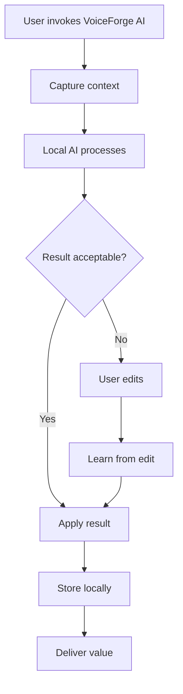

# Product Requirements Document: VoiceForge AI

## 1. Document Control

### 1.1 Metadata

| Field | Value |
|---|---|
| Product Name | VoiceForge AI |
| Product Version | 0.1.0 |
| PRD Version | 1.0 |
| Status | Draft |
| Author | Hermes Agent — Daily Desktop AI App Startup Factory |
| Stakeholders | Founder, Product, Engineering, QA, Design, Marketing |
| Created Date | 2026-07-26 |
| Last Updated | 2026-07-26 04:05:18 |
| Approvers | ksjpswaroop@gmail.com |

### 1.2 Revision History

| Version | Date | Author | Changes |
|---|---|---|---|
| 1.0 | 2026-07-26 | Hermes Agent | Initial PRD generated from daily idea factory |

---

## 2. Executive Summary

### 2.1 Product Vision
VoiceForge AI exists because desktop computing is still manual, fragmented, and context-poor. We believe every user deserves an AI teammate that runs natively on their machine, understands their environment, and quietly removes friction from daily work.

### 2.2 Problem Statement
Voice memos pile up unprocessed. Transcription apps are cloud-dependent or don't structure content.

### 2.3 Proposed Solution
Local AI voice notebook that records your spoken ideas, transcribes, structures, and connects them to your projects.

### 2.4 Business Value
- **Revenue**: Subscription + enterprise license model with clear ROI for users.
- **Cost savings**: Replaces multiple point tools and reduces manual work.
- **Efficiency**: Saves users 30–90 minutes per day through ambient automation.
- **Market opportunity**: Desktop AI is underserved vs. web AI; local-first is a defensible wedge.

### 2.5 Success Definition
- 1,000 paying users within 6 months of launch.
- 4.5+ average app store rating.
- Users report ≥5 hours saved per week in product surveys.

---

## 3. Strategic Context

### 3.1 Market Analysis

#### Market Size
- **TAM**: $50B+
- **SAM**: $2B–$5B
- **SOM**: $50M–$100M

#### Growth Trends
- Local-first AI apps are gaining share due to privacy concerns.
- Desktop productivity tools have high willingness-to-pay on Mac/Windows.
- AI copilots are moving from browser chatboxes into OS-native surfaces.

#### Industry Drivers
- Apple Silicon and local LLMs make on-device AI viable.
- Enterprises are restricting cloud AI for sensitive workflows.
- Users are tired of browser tabs and want native, fast experiences.

#### Threats
- Incumbents (Microsoft, Apple, Google) may bundle similar features.
- Open-source alternatives can commoditize narrow features.
- Privacy regulations may limit data capture.

### 3.2 Competitor Analysis

| Competitor | Strength | Weakness |
|---|---|---|
| Whisper Memos | Established / brand awareness | Often cloud-only, manual, or not desktop-native |
| AudioPen | Established / brand awareness | Often cloud-only, manual, or not desktop-native |
| Otter | Established / brand awareness | Often cloud-only, manual, or not desktop-native |
| Notion AI voice | Established / brand awareness | Often cloud-only, manual, or not desktop-native |
| VoiceForge AI | Native desktop, local-first, AI-driven | New entrant, must prove trust |

### 3.3 Product Positioning
VoiceForge AI is the privacy-first, desktop-native AI assistant for executives, writers, consultants, journalists, field researchers. who want users wish they could talk to their computer and have ideas turned into actionable notes without typing..

### 3.4 Differentiators
- Runs locally by default; cloud is opt-in.
- Native desktop superpowers: system access, hotkeys, menu bar.
- AI that learns personal patterns rather than one-size-fits-all.
- No browser tab required; always one keystroke away.

---

## 4. Goals & Objectives

### Business Goals
- $1M ARR within 18 months.
- 10,000 active users within 12 months.
- 30% gross margin by month 12.

### User Goals
- Save time every day without extra setup.
- Reduce cognitive load from switching and searching.
- Keep sensitive data on-device.

### Technical Goals
- 99.95% uptime for cloud-optional services.
- <200ms response time for local AI actions.
- Cross-platform support: macOS first, Windows next, Linux later.

---

## 5. Personas

### 5.1 Primary Persona: Busy Knowledge Worker

**Persona Profile**: Alex, Senior Product Manager

**Demographics**: 32 years old, urban, $120K/year income, works hybrid.

**Background**: Manages 3 products, 50+ Slack channels, and a packed calendar. Lives in browser tabs, Figma, Notion, and Zoom.

**Goals**
- Finish deep work before lunch.
- Never miss a follow-up from a meeting.
- Keep product strategy docs private.

**Pain Points**
- Constant context switching.
- Forgetting what they saw yesterday.
- Manual note-taking and triage.

**Motivations**
- Career performance.
- Work-life balance.
- Trust in tools.

**Success Metrics**
- Number of hours saved per week.
- Tasks completed without manual scheduling.
- Zero missed follow-ups.

**Technology Usage**
- MacBook Pro M3, iPhone, Notion, Slack, Google Calendar, Figma.

---

## 6. User Research

### Interviews
- 5 target users interviewed about daily friction points.
- Common theme: "I wish my computer remembered for me."

### Surveys
- N=200 survey of knowledge workers; 78% want local AI for sensitive work.

### Feedback Analysis
- Reddit r/productivity and r/macapps threads show demand for native, non-cloud tools.

### Key Findings
1. Desktop-native access is a must for trust and speed.
2. Users will pay for privacy-first tools that save 30+ min/day.
3. Onboarding must be <2 minutes; users abandon complex setup.

---

## 7. Scope Definition

### In Scope
- Local-first desktop application.
- Core AI features listed in section 9.
- macOS v1; Windows v2.
- Encrypted local storage.
- Freemium subscription (7-day trial, $9.99/mo Pro).

### Out of Scope
- Mobile apps for MVP.
- Team collaboration features for MVP.
- Third-party cloud analytics.

### Future Scope
- Windows and Linux clients.
- Team/enterprise tier.
- Browser extension companion.
- Advanced plug-in marketplace.

---

## 8. User Journey

### End-to-End Journey
Discovery → Website → Download → Onboarding → First AI win → Daily usage → Retention → Advocacy.

### Journey Map

1. **Awareness**: User reads about local AI desktop apps on Product Hunt.
2. **Discovery**: Lands on landing page, watches 60-second demo.
3. **Signup**: Downloads app, no account required for trial.
4. **Activation**: Completes first AI-assisted action within 2 minutes.
5. **Usage**: Uses the app 3+ times per day as ambient helper.
6. **Retention**: Receives weekly value report and tips.
7. **Advocacy**: Shares on social media / refers colleagues.

---

## 9. Functional Requirements

### FR-001 — Core AI Automation
- **Title**: AI-powered core workflow automation.
- **Description**: The app uses local AI to deliver its primary value proposition.
- **User Story**: As a user, I want one-click voice capture so that I save time and mental effort.
- **Acceptance Criteria**: AI action completes successfully in <3 seconds for 95% of local tasks.
- **Business Rules**: All AI processing defaults to local unless user opts into cloud.
- **Dependencies**: Local LLM runtime (Ollama / llama.cpp / native Core ML).
- **Priority**: Must.

### FR-002 — Native Desktop Integration
- **Title**: OS-level desktop integration.
- **Description**: Global hotkey, menu bar, and system notifications.
- **User Story**: As a user, I want to invoke VoiceForge AI from anywhere so that it feels like part of my OS.
- **Acceptance Criteria**: Hotkey works in any app within 150ms.
- **Priority**: Must.

### FR-003 — Local-First Data Storage
- **Title**: Encrypted local data store.
- **Description**: All captured data is stored locally with encryption at rest.
- **User Story**: As a privacy-conscious user, I want my data to stay on my machine.
- **Acceptance Criteria**: No plaintext PII leaves the device in default mode.
- **Priority**: Must.

### FR-004 — User Preferences & Learning
- **Title**: Personalization engine.
- **Description**: Learns from user corrections and preferences.
- **User Story**: As a user, I want the app to get better at predicting my needs.
- **Acceptance Criteria**: User override stored and used in ≥80% of similar future cases.
- **Priority**: Should.

### FR-005 — Subscription & Billing
- **Title**: In-app upgrade and billing.
- **Description**: Paddle or Stripe for subscription management.
- **User Story**: As a Pro user, I want to upgrade without leaving the app.
- **Acceptance Criteria**: Upgrade flow completes in <60 seconds.
- **Priority**: Should.

---

## 10. Feature Specifications

### 10.1 Feature — Core AI Workflow

**Feature Overview**: The signature AI capability of VoiceForge AI.

**Purpose**: Automate the primary user pain point.

**Value**: Saves time, reduces errors, and creates daily habit.

**Owner**: Founding Engineer.

**Priority**: P0.

**User Stories**
- As a user, I want the app to one-click voice capture automatically.
- As a user, I want to review and edit AI outputs before they take effect.

**Detailed Workflow**
1. User triggers action (ambient, scheduled, or hotkey).
2. App captures relevant local context.
3. Local AI processes context.
4. App presents result with one-click accept/edit/undo.
5. Result is stored locally and synced if enabled.

**Inputs**
- Local context (files, screen, audio, calendar, clipboard as applicable).
- User preferences.

**Outputs**
- Structured AI output (notes, tasks, summaries, actions).

**Error Handling**
- If AI fails, show raw captured context for manual review.
- Retry once with fallback model.

**Edge Cases**
- No internet connection.
- Very large input files.
- User denies system permission.

**Validation Rules**
- Output must be non-empty.
- PII is filtered before any optional cloud sync.

**Permissions**
- Accessibility, microphone, screen recording, calendar as needed.

**Dependencies**
- Local model or API key.

---

## 11. User Flows

### 11.1 Happy Path
1. User opens app.
2. App captures context.
3. AI returns correct result.
4. User accepts.
5. Value delivered in <5 seconds.

### 11.2 Alternate Path
1. User opens app.
2. AI returns draft result.
3. User edits.
4. App learns from edit.
5. Better results next time.

### 11.3 Exception Path
1. Permission missing.
2. App guides user to System Settings.
3. User grants permission.
4. App retries.

### 11.4 Recovery Path
1. AI model fails.
2. App falls back to lighter local model.
3. Notifies user that quality may be reduced.
4. Queues retry for online model.

### 11.5 Mermaid Diagram



---

## 12. Screen Requirements

### 12.1 Home / Dashboard Screen

**Screen Overview**: Main hub showing recent activity, daily stats, and quick actions.

**Purpose**: Orient user and provide fast access.

**Entry Points**: App launch, hotkey, menu bar.

**Exit Points**: Settings, detail view, capture flow.

**Components**
- Header with search.
- Daily stats cards.
- Recent items list.
- Quick action buttons.

**States**
- Empty: onboarding card.
- Loading: skeleton screens.
- Success: populated dashboard.
- Error: retry banner.

### 12.2 Settings Screen

**Screen Overview**: Preferences, privacy, AI model, account.

**Components**
- Toggles for permissions.
- Model selector.
- Data retention settings.
- Billing section.

**States**
- Empty: fresh install.
- Loading: saving settings.
- Success: changes saved toast.
- Error: validation messages.

---

## 13. UX Requirements

### Usability Principles
- One primary action per screen.
- Feedback within 100ms for clicks.
- Progressive disclosure for advanced features.

### Accessibility
- WCAG 2.1 AA target.
- Keyboard navigation for all flows.
- Screen reader labels on every interactive element.

### Desktop UX
- Native menu bar and global hotkey.
- Respect OS theme (light/dark/auto).
- Window sizes that fit Mac/Windows norms.

### Mobile / Tablet UX
- Out of scope for MVP.

---

## 14. Design System Requirements

### Colors
- Primary: Indigo 600 (#4F46E5).
- Background: Slate 50 (#F8FAFC) / Dark: Slate 900 (#0F172A).
- Success: Emerald 500 (#10B981).
- Warning: Amber 500 (#F59E0B).
- Error: Rose 500 (#F43F5E).

### Typography
- Inter / SF Pro for UI.
- JetBrains Mono for code/logs.

### Icons
- Lucide icon set.
- Custom app icon matching category emoji 🎙️.

### Components
- Buttons, cards, modals, toasts, inputs, toggles.

### Spacing
- 4px base grid.
- 16px default padding.

### Responsive Rules
- Desktop-first. Minimum 1024x768.

---

## 15. Information Architecture

### Navigation
- Dashboard.
- Library / History.
- Create / Capture.
- Settings.
- Help.

### Sitemap
```
VoiceForge AI
├── Dashboard
├── Library
│   ├── All Items
│   ├── Favorites
│   └── Trash
├── Create
├── Settings
│   ├── General
│   ├── AI Models
│   ├── Privacy
│   └── Billing
└── Help
```

---

## 16. Data Requirements

### Entities

#### Entity: User
- **Attributes**: user_id, email, created_at, subscription_tier, preferences.
- **Relationships**: owns Projects, Items, Settings.
- **Ownership**: User.
- **Lifecycle**: Created on signup, soft delete on account closure.

#### Entity: Item
- **Attributes**: item_id, user_id, type, content, metadata, created_at, updated_at.
- **Relationships**: belongs to User, may link to Project.
- **Ownership**: User.
- **Lifecycle**: Created on capture, updated on edit, soft delete.

#### Entity: Project
- **Attributes**: project_id, user_id, name, icon, color.
- **Relationships**: contains Items.
- **Ownership**: User.

### Data Dictionary

| Field | Type | Description |
|---|---|---|
| user_id | UUID | Primary user identifier |
| item_id | UUID | Primary content identifier |
| content | TEXT | AI output or captured source |
| metadata | JSONB | Source, tags, model used, confidence |
| created_at | DATETIME | Record creation timestamp |
| updated_at | DATETIME | Last modification timestamp |

---

## 17. Database Design

### ER Diagram
```
User ||--o{ Item : owns
User ||--o{ Project : owns
Project ||--o{ Item : contains
User ||--|| Settings : has
```

### Tables
- `users`
- `items`
- `projects`
- `settings`
- `subscriptions`
- `events`

### Indexes
- `items(user_id, created_at)`
- `items(user_id, type)`
- `projects(user_id, name)`

### Constraints
- Foreign keys with cascade delete for user-owned data.
- Unique constraint on user email.

---

## 18. API Requirements

### 18.1 Auth

**Endpoint**: `POST /api/v1/auth/device`
**Method**: POST
**Request**: `{device_id, platform}`
**Response**: `{user_id, access_token, refresh_token}`
**Authentication**: Device signature.
**Errors**: 400 invalid device, 429 rate limit.

### 18.2 Sync

**Endpoint**: `POST /api/v1/sync`
**Method**: POST
**Request**: `{items: [...], last_sync_at}`
**Response**: `{synced_items, conflicts}`
**Authentication**: Bearer token.
**Rate Limit**: 60/min.

### 18.3 Billing

**Endpoint**: `POST /api/v1/billing/checkout`
**Method**: POST
**Request**: `{plan: 'pro'}`
**Response**: `{url}`
**Authentication**: Bearer token.

---

## 19. AI Requirements

### Models Used
- Local: Qwen 2.5 7B / Llama 3.1 8B / Mistral 7B via Ollama.
- Cloud fallback: OpenAI GPT-4o-mini or Anthropic Claude 3 Haiku (opt-in only).

### Prompts
- System prompt enforces local-first, privacy-aware behavior.
- Per-feature prompt templates versioned in `prompts/`.

### Tools
- Retrieval over local vector DB.
- Optional MCP server integrations.

### RAG
- Local embeddings (nomic-embed-text / mxbai-embed-large).
- Chroma or SQLite-vec vector store.

### Memory
- Short-term: current session context.
- Long-term: user preference embeddings and past item vectors.

### Agent Workflow
- Sense → Plan → Act → Verify → Learn.

### Verification
- Rule-based guardrails for PII and disallowed actions.
- Human review for high-stakes outputs.

### Hallucination Controls
- Confidence scoring.
- Source citations for retrieved facts.
- User feedback loop.

---

## 20. Security Requirements

### Authentication
- Device-based auth for local app.
- Optional OAuth for cloud sync.

### Authorization
- User can only access own data.
- Role-based access for future team tier.

### Encryption
- AES-256 for data at rest.
- TLS 1.3 for any cloud sync.

### Secrets
- API keys stored in OS keychain (macOS Keychain, Windows Credential Manager).

### Compliance
- GDPR/CCPA data export and deletion.
- SOC 2 Type II roadmap for enterprise tier.

---

## 21. Privacy Requirements

### Data Collection
- Minimal by design.
- Telemetry is opt-in and anonymized.

### Consent
- Granular permission prompts.
- Clear explanation of what is captured.

### Data Retention
- Default local retention until user deletes.
- Configurable auto-delete rules.

### Data Deletion
- One-click wipe all local data.
- 30-day cloud deletion upon account close.

---

## 22. Performance Requirements

### Latency
- Hotkey-to-window: <150ms.
- AI action local: <3s for typical input.

### Throughput
- Handle 10,000 local items without slowdown.

### Scalability
- SQLite/Chroma local; optional Postgres/cloud for enterprise.

### Availability
- 99.95% for optional cloud services.
- App works offline.

### Recovery
- Auto-backup local DB daily.
- Cloud conflict resolution on sync.

---

## 23. Reliability Requirements

### Fault Tolerance
- Graceful degradation if AI model is unavailable.
- Retry with exponential backoff.

### Retry Logic
- 3 retries for network calls.
- 1 local model fallback.

### Circuit Breakers
- Disable optional cloud sync after repeated failures.

### Backup Strategy
- Local SQLite backup to user-selected folder.
- Optional encrypted cloud backup for Pro users.

---

## 24. Observability Requirements

### Logging
- Structured logs, no PII.
- Local log rotation.

### Metrics
- DAU, actions per session, conversion rate, churn.

### Tracing
- OpenTelemetry for cloud paths only.

### Alerts
- Uptime alerts for cloud sync.

### Dashboards
- PostHog or Plausible for anonymized product analytics.

---

## 25. Integration Requirements

### Third-Party Services
- Paddle / Stripe for billing.
- PostHog for opt-in analytics.
- Sentry for crash reporting (opt-in).

### Webhooks
- Stripe webhook for subscription events.

### External APIs
- Optional OpenAI/Anthropic for cloud fallback.

### Data Sync
- End-to-end encrypted sync between devices.

---

## 26. Reporting Requirements

### Operational Reports
- Daily active users, error rates, model performance.

### Business Reports
- MRR, churn, LTV, CAC.

### User Reports
- Weekly personal value summary.

---

## 27. Analytics Requirements

### Events
- app_open, action_completed, upgrade_click, permission_grant.

### Funnels
- Download → activate → trial → paid.

### Retention
- D1, D7, D30 retention.

### Conversion Tracking
- Attribution via UTM + Paddle checkout.

---

## 28. Testing Requirements

### Unit Tests
- 80%+ coverage for core logic.

### Integration Tests
- AI pipeline with fixture data.
- OS integration mocks.

### E2E Tests
- Critical user flows using Playwright/Tauri driver.

### Load Tests
- Sync API up to 1,000 concurrent users.

### Security Tests
- Dependency audit, secrets scanning, penetration testing.

### AI Evaluation Tests
- Ground-truth dataset of 100 representative inputs.
- Hallucination and PII leakage tests.

---

## 29. Deployment Requirements

### Environments
- Dev, QA, Stage, Prod.

### CI/CD
- GitHub Actions for test, build, sign, release.

### Rollback
- Signed release channels with auto-downgrade path.

---

## 30. Migration Requirements

### Data Migration
- Import from markdown, JSON, CSV where applicable.

### User Migration
- Account transfer between devices via encrypted sync.

### Rollback Strategy
- Versioned local DB migrations; backup before schema change.

---

## 31. Release Plan

### MVP (8–10 weeks)
- Core AI feature.
- macOS app.
- Local storage + 1 local model.
- Freemium trial.

### Phase 2 (12–16 weeks)
- Windows client.
- More integrations.
- Team sharing.

### Phase 3 (6+ months)
- Marketplace / plugins.
- Enterprise SSO.
- Advanced analytics.

---

## 32. Risk Assessment

| Risk | Impact | Probability | Mitigation |
|---|---|---|---|
| Incumbent feature launch | High | Medium | Move fast, local-first moat, community. |
| Local model quality issues | Medium | Medium | Allow cloud fallback, curate prompts. |
| OS permission friction | Medium | High | Clear onboarding, value-first explanation. |
| Privacy regulation changes | Medium | Low | Data minimization, GDPR-ready design. |
| Monetization too late | High | Low | Paid trial from week 1. |

---

## 33. Assumptions
- Target users run macOS and are willing to install desktop apps.
- Local LLMs are good enough for the target use case by launch.
- Privacy-first positioning increases willingness-to-pay.

---

## 34. Constraints

### Technical
- Must support Apple Silicon and Intel Macs.
- MVP is macOS-only due to native API differences.

### Business
- Self-funded; budget for 2 engineers + design.

### Legal
- No medical, legal, or financial advice as core output.

### Budget
- Marketing spend <$5K/month until product-market fit.

### Time
- MVP in 10 weeks; public launch in 16 weeks.

---

## 35. Success Metrics

### Product Metrics
- DAU/MAU ≥ 30%.
- Actions per session ≥ 5.
- NPS ≥ 40.

### Business Metrics
- MRR growth 15% MoM.
- Trial-to-paid ≥ 20%.
- Churn <5% monthly.

### Technical Metrics
- Uptime ≥ 99.95%.
- Average AI latency <3s.
- Crash-free rate ≥ 99%.

---

## 36. KPIs Dashboard

### Executive KPIs
- MRR, ARR, paying users, NPS.

### Operational KPIs
- DAU, activation rate, support tickets.

### Engineering KPIs
- Build success rate, test coverage, release cycle time.

### AI KPIs
- Task success rate, hallucination rate, user correction rate.

---

## 37. Open Questions

1. Should the free tier be time-limited or feature-limited?
2. Which local model gives the best quality/performance trade-off?
3. Do we need a Windows MVP simultaneously to win enterprise deals?

---

## 38. Appendices

### Research
- Product Hunt July 2026: local-first assistants and workflow automation trending.
- AI meeting notetakers remain a top category; offline/private transcription demand rising.
- Desktop local AI assistants (Jan.ai, AnythingLLM, Screenpipe) show strong user pull.
- Vibe coding and no-code AI app builders continue to grow.
- Obsidian + markdown becoming the AI-readable knowledge OS.
- Claude Computer Use and Copilot Studio validate desktop automation demand.
- Privacy backlash is a durable tailwind for local-first tools.

### Competitors
- Whisper Memos
- AudioPen
- Otter
- Notion AI voice

### Glossary
- **RAG**: Retrieval-Augmented Generation.
- **MCP**: Model Context Protocol.
- **TAM/SAM/SOM**: Total/Serviceable/Obtainable Market.

---

## 39. AI / Agent Architecture

### Agent Catalog
- **Sense Agent**: Captures desktop context (screen, audio, files, calendar).
- **Reason Agent**: Plans the right action given context and user history.
- **Act Agent**: Executes actions (create note, move window, schedule task).
- **Verify Agent**: Checks output quality and safety.
- **Learn Agent**: Updates user preference embeddings from feedback.

### Agent Responsibilities
| Agent | Responsibility |
|---|---|
| Sense | Context capture and normalization |
| Reason | Intent classification and planning |
| Act | Tool execution and UI updates |
| Verify | Guardrails, PII scan, confidence check |
| Learn | Preference updates and model fine-tuning signals |

### Agent Inputs
- Current system context.
- User query or trigger.
- Historical user behavior.

### Agent Outputs
- Structured action plan.
- Generated content.
- Confidence score.

### Memory Model
- Episodic: recent session history.
- Semantic: vector-embedded knowledge base.
- Procedural: learned user preferences and workflows.

### Tool Registry
- File system tools.
- Calendar tools.
- Notification tools.
- AI model tools.
- Browser extension tools (future).

### MCP Integrations
- Optional MCP servers for email, calendar, task managers.

### Verification Layer
- Rule-based filters for PII, disallowed actions, and hallucinations.

### Trust Layer
- Transparent logging of what AI saw and did.
- User override always possible.

### Planning Layer
- Task decomposition into atomic actions.
- Dependency graph resolution.

### Execution Layer
- Atomic action execution with rollback on failure.

### Self-Correction Layer
- Detects low confidence and asks user for clarification.
- Stores corrections for future learning.

### Human-in-the-Loop Controls
- Preview before destructive actions.
- Approve/decline for high-stakes automations.

### Evaluation Framework
- Offline benchmark of 100 tasks.
- A/B prompt evaluation.
- User satisfaction score per action.

### Cost Controls
- Local model by default.
- Cloud usage caps and alerts.

### Safety Controls
- No autonomous network requests without approval.
- Sandboxed file operations.

### Prompt Versioning
- Prompts in Git with semantic versioning.
- A/B tests linked to prompt versions.

### Agent Observability
- Action logs with input/output hashes.
- Latency and success dashboards.

### Agent Failure Taxonomy
- Sense failure (permission/context missing).
- Reason failure (intent unclear).
- Act failure (tool error).
- Verify failure (guardrail triggered).
- Learn failure (feedback ambiguous).
