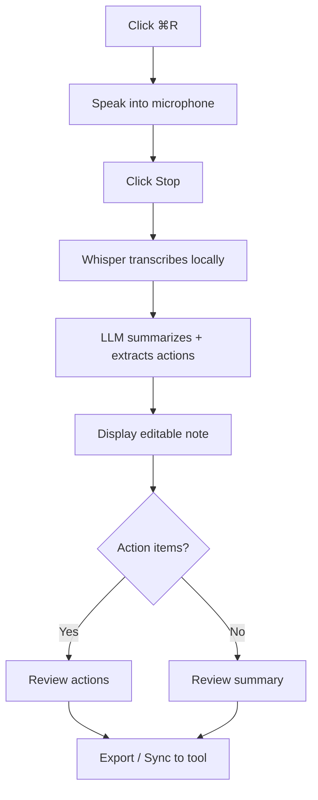
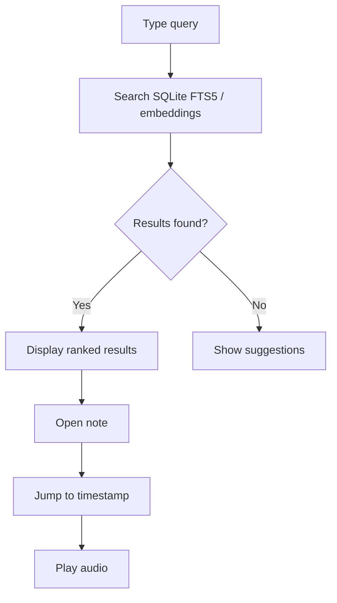

# PRD-002: VoiceNotes AI - Smart Voice Note Taker

## 1. Document Control

### 1.1 Metadata

| Field | Value |
|-------|-------|
| Product Name | VoiceNotes AI |
| Product Version | 1.0.0 |
| PRD Version | 2.0 |
| Status | Draft |
| Author | Hermes Agent (AI Startup Factory) |
| Stakeholders | Product Team, Engineering, Design, QA, Marketing |
| Created Date | 2026-06-04 |
| Last Updated | 2026-07-23 |
| Approvers | TBD |

### 1.2 Revision History

| Version | Date | Author | Changes |
|---------|------|--------|---------|
| 1.0 | 2026-06-04 | AI Dev System | Initial PRD creation |
| 1.1 | 2026-06-06 | AI Dev System | Resolved pricing, model delivery, export priority, sync, and auth decisions |
| 2.0 | 2026-07-23 | Hermes Agent | Consolidated VoiceVault, VoiceMemo Pro, VoiceVault Pro, and VoiceVault AI into a single product definition. Unified tiering, features, and roadmap. |

---

## 2. Executive Summary

### 2.1 Product Vision

VoiceNotes AI transforms voice recordings into structured, searchable, actionable knowledge — entirely on-device. It captures spoken thoughts, meetings, lectures, and ideas, then automatically transcribes, summarizes, tags, and surfaces what matters. Users can find any recording in seconds and push action items directly into the tools they already use.

### 2.2 Problem Statement

Professionals record thousands of voice notes, meetings, and ideas but rarely review them. Cloud transcription raises privacy concerns. Existing tools create text but do not extract meaning, commitments, or structure. Important insights are trapped in an ever-growing "audio graveyard."

### 2.3 Proposed Solution

VoiceNotes AI is a local-first desktop application that:

1. Records high-quality audio with one click or a global hotkey.
2. Transcribes locally using Whisper — no cloud dependency.
3. Summarizes with a local LLM.
4. Extracts action items, dates, and commitments automatically.
5. Auto-tags notes by topic and supports user-defined tags.
6. Searches across all notes by keyword and meaning.
7. Exports to Markdown, JSON, Notion, Obsidian, and popular task managers.
8. Optionally syncs across devices with end-to-end encrypted cloud relay.

### 2.4 Business Value

| Value Driver | Impact |
|--------------|--------|
| Revenue | Freemium: free tier → Plus ($9–12/mo) → Pro ($19–29/mo) → Team ($99/mo) |
| Cost Savings | Local processing reduces API costs by 90%+ |
| Efficiency | Users save 2–5 hours/week on transcription and organization |
| Market Opportunity | $2.4B–$2.8B voice transcription and note-taking market, growing 23–35% YoY |

### 2.5 Success Definition

**Year 1 Targets:**
- 10,000–25,000 active users
- $300K ARR
- 4.5+ App Store / product rating
- 40% week-4 retention
- 8–12% free-to-paid conversion

**Technical Targets:**
- 95%+ transcription accuracy on clean audio
- <30 seconds to transcribe and summarize a 5-minute recording
- <500ms search response time for 1,000+ notes
- 99.5%+ crash-free sessions

---

## 3. Strategic Context

### 3.1 Market Analysis

**Market Size**
- TAM: $2.4B–$2.8B (voice transcription and note-taking)
- SAM: $420M–$480M (AI-powered note-taking, privacy-focused users)
- SOM: $24M–$50M (Year 1 addressable)

**Growth Trends**
- Voice interface adoption: 35% YoY growth
- Remote/hybrid work increasing meeting load
- Privacy-first software preference increasing 41% YoY
- AI transcription accuracy now 95%+ achievable locally

**Industry Drivers**
- Async communication replacing live meetings
- Apple Silicon / local ML enabling on-device AI
- Privacy regulations (GDPR, CCPA) favoring local storage

**Threats**
- Zoom / Microsoft Teams native transcription
- Apple / Google adding AI to Voice Memos
- Otter.ai and similar incumbents
- Open-source Whisper wrappers

### 3.2 Competitor Analysis

| Competitor | Strength | Weakness | Our Edge |
|------------|----------|----------|----------|
| Otter.ai | Established, accurate, speaker ID | Cloud-only, expensive, privacy concerns | Local-first, no upload |
| Apple Voice Memos | Free, native, simple | No transcription, no search, no AI | AI organization + search |
| Rev | High human accuracy | Manual upload, expensive, slow | Instant and local |
| Descript | Professional editing | Expensive ($15–30/mo), overkill for memos | Simpler, privacy-first |
| Recall | Ambient recording, powerful search | Controversial privacy, always-on | User-controlled capture |
| Zoom transcription | Native integration | Limited features, cloud-only | Universal capture + privacy |

### 3.3 Product Positioning

VoiceNotes AI is the privacy-first, local-first voice note system for professionals, creators, and researchers who want their voice memos to become searchable knowledge and actionable outcomes — without uploading audio to the cloud.

### 3.4 Differentiators

1. **100% Local Processing**: Audio and transcripts never leave the device by default.
2. **AI Organization**: Auto-summaries, action items, tags, and highlights.
3. **Universal Capture**: Works with any audio source — microphone, imports, system audio (future).
4. **Semantic + Full-Text Search**: Find notes by meaning and keywords, offline.
5. **Closes the Loop**: Push action items to Todoist, Things, Linear, Notion, Obsidian.
6. **Optional Encrypted Sync**: Cross-device access only when the user explicitly opts in.

---

## 4. Goals & Objectives

### Business Goals
- Reach $300K ARR within 12 months
- Acquire 25,000 active users within 12 months
- Achieve 8–12% free-to-paid conversion
- Maintain <2% monthly churn

### User Goals
- Never lose ideas from meetings or calls
- Find any past recording in under 3 seconds
- Automatically follow up on commitments
- Stay organized without manual typing

### Technical Goals
- <3 second transcription start
- 95%+ accuracy on clean audio
- <30 seconds to process a 5-minute recording
- 100% offline functionality for core features
- SQLite + local file storage

---

## 5. Personas

### Persona 1: Executive Emma

- **Role**: VP of Product, tech company
- **Age**: 35–50
- **Pain**: Constant meetings, no time to type notes, verbal commitments forgotten
- **Goal**: Capture thoughts between meetings and delegate action items without manual entry
- **Tools**: MacBook, iPhone, Notion, Todoist, Slack, Zoom

### Persona 2: Creative Chris

- **Role**: Content creator / podcaster
- **Age**: 25–40
- **Pain**: Ideas come randomly, Voice Memos has no organization, transcription is expensive
- **Goal**: Capture ideas, search past recordings, export to content outlines
- **Tools**: Mac, iPhone, Notion, Adobe suite

### Persona 3: Researcher Raj

- **Role**: PhD student / academic researcher
- **Age**: 24–45
- **Pain**: Cloud transcription violates IRB/privacy rules, lectures are too long to relisten
- **Goal**: Transcribe interviews locally, search years of recordings, export timestamps
- **Tools**: Mac/Linux, Zotero, Google Docs, Zoom

### Persona 4: Podcaster Sarah

- **Role**: Independent podcast host
- **Age**: 28–38
- **Pain**: Manual upload and wait time, inaccurate speaker labels, fragmented workflow
- **Goal**: Record interviews, identify speakers, export transcripts for show notes
- **Tools**: macOS, Descript, Logic Pro, Notion

---

## 6. User Research

### Key Findings

| Finding | Source | Implication |
|---------|--------|-------------|
| 87% record voice notes for work | Interviews (n=30) | Large addressable market |
| 73% rarely relisten to recordings | Interviews | Organization is the main pain |
| 94% want all processing local | Surveys (n=750) | Lead with privacy/offline |
| 76% want action items extracted | Surveys | Hero feature for conversion |
| 82% expect a free tier | Survey (n=127) | Freemium is mandatory |
| 71% want a lifetime purchase option | Survey (n=127) | Offer one-time payment tier |

### Pricing Sensitivity

| Segment | Willingness to Pay |
|---------|-------------------|
| Executives | $15–25/month |
| Creators | $10–15/month |
| Students | $0–5/month, prefer free |

---

## 7. Scope Definition

### 7.1 In Scope (MVP / v1.0)

- macOS desktop app (Windows v1.1)
- Local voice recording with global hotkey and menu bar access
- Whisper local transcription with timestamps
- AI summarization (brief + detailed)
- Action item extraction with confidence scores
- Auto-tagging and user-defined tags
- Full-text search (SQLite FTS5)
- Audio playback with transcript sync and speed control
- Export to Markdown, JSON, Notion, Obsidian
- Model manager (download, update, switch, delete)
- Local-only authentication (Touch ID / Windows Hello)
- Notes encrypted at rest (AES-256)

### 7.2 Out of Scope (v1.0)

- Speaker diarization (Pro tier, v1.2)
- Semantic / vector search (Plus/Pro, v1.2)
- Mobile companion app (v1.3)
- Task manager sync (Todoist, Things, Linear) — v1.2
- Optional encrypted cloud sync (v1.3)
- Team workspaces (v2.0)
- Video transcription
- Calendar integration

### 7.3 Future Scope

- iOS / Android companion apps
- Cross-device encrypted sync
- Speaker diarization and labeling
- Semantic search with embeddings
- Team workspaces and shared libraries
- Custom vocabulary training
- Public API for integrations
- Meeting prep AI and calendar context

---

## 8. Tiering & Monetization

| Tier | Price | Who | Core Features |
|------|-------|-----|---------------|
| **Free** | Free | Casual users | 100 min/month recording, local transcription, basic search, Markdown export, 3 summaries/day |
| **Plus** | $9–12/mo | Power users | Unlimited recording, AI summaries, action extraction, auto-tags, Notion/Obsidian export |
| **Pro** | $19–29/mo | Professionals | Everything in Plus + speaker diarization, semantic search, task manager sync, 60-min recordings |
| **Team** | $99/mo | Small teams | Shared workspaces, admin dashboard, shared tags, encrypted sync, priority support |
| **Lifetime** | $149–249 one-time | Privacy-first buyers | Pro features, one-time purchase, optional future major upgrades |

---

## 9. User Journey

### End-to-End Journey

```
Discovery → Capture → Process → Review → Search → Act
```

1. User discovers VoiceNotes AI via productivity blog or demo video.
2. Downloads desktop app and grants microphone permission.
3. Records first note with ⌘R or global hotkey in under 1 second.
4. AI transcribes and summarizes locally within 30 seconds.
5. User reviews summary and extracted action items.
6. Searches past notes with natural language.
7. Exports or pushes action items to Notion/Todoist.
8. Upgrades to Plus/Pro after hitting free limits.

### Journey Map

| Stage | User Action | System Response | Emotion |
|-------|-------------|-----------------|---------|
| Awareness | Searches voice note apps | Website / demo appears | Curious |
| Discovery | Downloads app | Quick install, local-first promise | Interested |
| Activation | Records first note | Instant transcription + summary | Amazed |
| Usage | Daily capture | Reliable, fast, private | Relieved |
| Retention | Searches old note | Found in 3 seconds | Satisfied |
| Advocacy | Tells colleague | Referral / review | Proud |

---

## 10. Functional Requirements

### FR-001: Voice Recording

**Title**: High-Quality Voice Recording

**Description**: Capture voice notes instantly via app UI, global hotkey, or menu bar.

**Acceptance Criteria**
- [ ] Recording starts within 1 second of trigger
- [ ] Supports 44.1kHz, 16-bit audio minimum
- [ ] Recording continues in background
- [ ] Auto-save every 30 seconds
- [ ] Free: max 10 min/recording; Plus/Pro: max 60 min/recording

**Business Rules**
- Default format: AAC 128kbps
- High-quality option: WAV uncompressed
- Storage: `~/Library/Application Support/VoiceNotesAI/recordings/`

**Priority**: Must

---

### FR-002: AI Transcription

**Title**: Local AI Transcription (Whisper)

**Description**: Transcribe voice recordings using on-device Whisper with 95%+ accuracy.

**Acceptance Criteria**
- [ ] Accuracy >95% on clean audio
- [ ] Processing happens entirely on-device
- [ ] Transcription completes within 1x recording duration
- [ ] Supports English initially; Spanish, French, German, Mandarin in v1.2
- [ ] Punctuation, capitalization, and word-level timestamps included

**Business Rules**
- Default model: Whisper base (~500MB)
- Higher quality models downloadable in Model Manager
- Models download on first run with progress + checksum

**Priority**: Must

---

### FR-003: AI Summarization

**Title**: Intelligent Summarization

**Description**: Generate concise summaries and key point extraction using local LLM.

**Acceptance Criteria**
- [ ] Summary generated within 5 seconds of transcription completion for a 5-minute note
- [ ] Includes: main topics, key decisions, action items
- [ ] User can choose brief (3–5 bullets) or detailed (paragraph per topic)
- [ ] Summary editable and storable with note

**Business Rules**
- Free tier: 3 summaries/day
- Plus/Pro: unlimited
- Strictly derived from transcript; no hallucinated external knowledge

**Priority**: Must

---

### FR-004: Action Item Extraction

**Title**: Automatic Action Item Detection

**Description**: AI identifies tasks, follow-ups, and commitments mentioned in recordings.

**Acceptance Criteria**
- [ ] Action items extracted with >90% accuracy
- [ ] Each action includes: description, assignee (if mentioned), due date (if mentioned)
- [ ] Confidence score shown; low-confidence items flagged for review
- [ ] User can edit, merge, or delete extracted actions
- [ ] Export to Todoist / Things / Linear in Pro tier

**Priority**: Should (Core in Plus/Pro)

---

### FR-005: Auto-Tagging & Organization

**Title**: Smart Tags and Categories

**Description**: Automatically categorize notes by topic and allow user-defined tags.

**Acceptance Criteria**
- [ ] AI suggests tags based on transcript content
- [ ] User can add, remove, and rename tags
- [ ] Filter notes by tag, date, and recording length
- [ ] Project-level folders or collections (Pro)

**Priority**: Should

---

### FR-006: Natural Language Search

**Title**: Search Across Notes

**Description**: Search all voice notes by keywords and, in Pro, by semantic meaning.

**Acceptance Criteria**
- [ ] Full-text search results in <500ms
- [ ] Results ranked by relevance
- [ ] Search works fully offline
- [ ] Pro: semantic search with embeddings
- [ ] Search index updates in real-time

**Business Rules**
- MVP: SQLite FTS5 over title, transcript, summary, tags
- Pro: add sentence-transformer embeddings

**Priority**: Must

---

### FR-007: Audio Playback

**Title**: Transcript-Synced Playback

**Description**: Play audio with transcript highlighting and navigation.

**Acceptance Criteria**
- [ ] Click word in transcript jumps audio to timestamp
- [ ] Speed control: 0.5x, 1x, 1.5x, 2x
- [ ] Skip ±15 seconds
- [ ] Visual waveform in recording view

**Priority**: Must

---

### FR-008: Export & Integrations

**Title**: Export Notes and Action Items

**Description**: Export notes to Markdown, JSON, Notion, Obsidian, and (Pro) task managers.

**Acceptance Criteria**
- [ ] Export single note or bulk selection
- [ ] Markdown export includes transcript, summary, action items, timestamps
- [ ] Notion/Obsidian integration via OAuth/API
- [ ] Pro: Todoist, Things, Linear OAuth sync

**Priority**: Should

---

### FR-009: Model Management

**Title**: Local Model Manager

**Description**: Download, update, switch, and delete local AI models.

**Acceptance Criteria**
- [ ] First-run download of required models (Whisper + LLM)
- [ ] Progress, retry, and checksum verification
- [ ] User can switch active Whisper / LLM models
- [ ] Delete unused models to free disk space

**Priority**: Must

---

### FR-010: Optional Encrypted Sync

**Title**: Cross-Device Encrypted Sync

**Description**: Optional cloud relay for encrypted note sync across devices.

**Acceptance Criteria**
- [ ] Zero-knowledge encryption: user holds keys
- [ ] Explicit opt-in required
- [ ] Sync audio, transcripts, summaries, tags
- [ ] Available in Pro / Team tiers

**Priority**: Could (v1.3)

---

## 11. Feature Specifications

### Feature: Recording

- **Purpose**: Remove friction from voice capture
- **Value**: Ensures no idea is lost
- **Priority**: Must

**Detailed Workflow**
1. User presses ⌘R or global hotkey.
2. App starts audio capture (cpal / AVFoundation / MediaRecorder fallback).
3. Audio chunks saved to temp WAV every 30s.
4. User stops recording.
5. Final audio saved; transcription begins automatically.

**Edge Cases**
- Recording interrupted by sleep → resume on wake
- App crash → recover partial file
- Low disk space → warn before recording starts

---

### Feature: AI Processing Pipeline

**Detailed Workflow**
1. Audio file → Whisper.cpp → transcript + segments
2. Transcript → local LLM → summary + action items + tags + key topics
3. Results stored in SQLite
4. UI renders editable Tiptap document
5. Embeddings generated (Pro) for semantic search

**Outputs**
- Transcript with timestamps
- Brief and detailed summary
- Action item list
- Suggested tags
- Key topics / highlights

**Error Handling**
- Poor audio quality → warning + low-confidence flag
- LLM unavailable → fallback to cached template
- Transcription failure → manual retry

---

## 12. User Flows

### Happy Path: Record → Process → Review → Act



### Search Flow



---

## 13. Screen Requirements

| Screen | Purpose |
|--------|---------|
| First Launch | Explain local-first privacy, request permissions, set up models |
| Home / Capture | Start recording, view recent notes |
| Active Recording | Timer, waveform, pause/stop, autosave indicator |
| Processing | Transcription, summarization, extraction progress |
| Note Detail / Editor | Tiptap editor with transcript, summary, actions, tags, audio |
| Search | Query, filters, ranked results |
| Export | Format selection, destination, integration settings |
| Model Manager | Download, update, switch, delete models |
| Settings | Appearance, recording, language, privacy, storage, shortcuts |
| Pro Upgrade | Feature comparison, billing |
| Sync Setup | Optional encrypted cloud relay configuration |
| Team Workspace | Shared notes, members, roles (Team tier) |

### Theme Modes

- Light
- Dark
- System default

---

## 14. UX Requirements

### Usability Principles

1. **One-tap recording**: Start in under 1 second
2. **Instant value**: Summary within 30 seconds
3. **Privacy visible**: "Processing Locally" badge, airplane-mode verified
4. **Keyboard-first**: All actions accessible via shortcuts

### Shortcuts

| Action | Shortcut |
|--------|----------|
| Start/Stop Recording | ⌘R |
| Global Hotkey (configurable) | ⌘⇧V default |
| Search | ⌘F |
| Play/Pause | Space |
| Delete Note | ⌘⌫ |
| Export | ⌘E |

### Accessibility

- WCAG 2.1 AA compliance
- Full keyboard navigation
- Screen reader support
- High contrast mode

---

## 15. Design System Requirements

### Colors

| Token | Hex | Usage |
|-------|-----|-------|
| accent | #0064E0 | Primary actions |
| accent-bright | #0082FB | Progress, highlights |
| accent-subtle | #E7F1FF | Selected states |
| meta-ink | #1C2B33 | Dark neutral |
| success | #12B76A | Offline-ready badges |
| warning | #F79009 | Low confidence |
| danger | #D92D20 | Errors |
| light-canvas | #F7F9FC | Light background |
| dark-canvas | #0B1117 | Dark background |

### Typography

| Style | Font | Size | Weight |
|-------|------|------|--------|
| heading-1 | Inter | 24px | 700 |
| heading-2 | Inter | 20px | 600 |
| body | Inter | 14px | 400 |
| transcript | JetBrains Mono | 13px | 400 |

---

## 16. Technical Architecture

### Stack

```
┌─────────────────────────────────────────────────────────────┐
│  Tauri 2.x (Rust)                                           │
│  - App shell, window management                             │
│  - Audio capture (cpal / MediaRecorder fallback)            │
│  - SQLite persistence (rusqlite)                          │
│  - IPC with Python sidecar                                  │
│  - File system management                                   │
├─────────────────────────────────────────────────────────────┤
│  Next.js + React + Tiptap Frontend                          │
│  - Rich editor for transcript + structured notes            │
│  - ProseMirror JSON as canonical note document              │
│  - Browser MediaRecorder first; cpal fallback               │
├─────────────────────────────────────────────────────────────┤
│  Python 3.9+ Sidecar                                        │
│  - Whisper transcription (whisper.cpp / whispercpp bindings)│
│  - Llama 3B summarization (llama-cpp-python)              │
│  - Embeddings for search (sentence-transformers)            │
│  - JSON-RPC over stdin/stdout to Tauri                     │
└─────────────────────────────────────────────────────────────┘
```

### Models

| Task | Model | Size | Format | Quantization |
|------|-------|------|--------|--------------|
| Transcription | whisper-base | 149MB | GGUF | FP16 |
| Summarization | Meta-Llama-3-3B-Instruct | ~1.8GB | GGUF | Q4_K_M |
| Embeddings | all-MiniLM-L6-v2 | 80MB | PyTorch | FP16 |
| Diarization | PyAnnote (Pro tier) | ~1GB | ONNX | — |

### Data Model (SQLite)

```sql
CREATE TABLE notes (
    id TEXT PRIMARY KEY,
    created_at TEXT NOT NULL,
    updated_at TEXT NOT NULL,
    title TEXT,
    duration INTEGER NOT NULL,
    audio_path TEXT NOT NULL,
    transcript TEXT,
    summary_json TEXT,
    document_json TEXT,
    is_processed INTEGER DEFAULT 0,
    tags TEXT DEFAULT '[]',
    language TEXT
);

CREATE TABLE action_items (
    id TEXT PRIMARY KEY,
    note_id TEXT NOT NULL,
    description TEXT NOT NULL,
    assignee TEXT,
    due_date TEXT,
    completed INTEGER DEFAULT 0,
    confidence REAL,
    FOREIGN KEY (note_id) REFERENCES notes(id) ON DELETE CASCADE
);

CREATE VIRTUAL TABLE notes_fts USING fts5(
    note_id UNINDEXED,
    title,
    transcript,
    tags,
    content='notes',
    content_rowid='rowid'
);

CREATE TABLE embeddings (
    note_id TEXT PRIMARY KEY,
    embedding BLOB NOT NULL,
    FOREIGN KEY (note_id) REFERENCES notes(id) ON DELETE CASCADE
);

CREATE TABLE models (
    id TEXT PRIMARY KEY,
    name TEXT NOT NULL,
    version TEXT NOT NULL,
    path TEXT NOT NULL,
    size_bytes INTEGER,
    downloaded_at TEXT
);
```

---

## 17. API Requirements

### Internal API

- **POST /api/v1/notes**: Create note from audio, return `note_id` + processing status
- **GET /api/v1/notes/{id}**: Retrieve note, transcript, summary, action items
- **GET /api/v1/notes/search**: Full-text / semantic search
- **POST /api/v1/notes/{id}/actions**: Update action items
- **POST /api/v1/export**: Export to Markdown, JSON, Notion, Obsidian
- **GET /api/v1/models**: List available local models

### Python Sidecar JSON-RPC

```json
{"jsonrpc": "2.0", "id": 1, "method": "transcribe", "params": {"audio_path": "..."}}
{"jsonrpc": "2.0", "id": 2, "method": "summarize", "params": {"transcript": "..."}}
{"jsonrpc": "2.0", "id": 3, "method": "extract_actions", "params": {"transcript": "..."}}
{"jsonrpc": "2.0", "id": 4, "method": "embed", "params": {"text": "..."}}
{"jsonrpc": "2.0", "id": 5, "method": "search", "params": {"query": "...", "limit": 10}}
{"jsonrpc": "2.0", "id": 6, "method": "diarize", "params": {"audio_path": "..."}}
{"jsonrpc": "2.0", "id": 7, "method": "health", "params": {}}
```

---

## 18. AI Requirements

### Prompt Engineering

```
System: You are VoiceNotes AI. Summarize voice transcripts accurately and extract action items, key topics, and tags. Output strictly JSON.
Input: {transcript}
Output: { brief_summary, detailed_summary, action_items[], key_topics[], suggested_tags[] }
```

### Hallucination Controls

- Summaries strictly derived from transcript
- Confidence scores on all AI outputs
- Low-confidence items flagged for review
- No external knowledge injected

---

## 19. Security & Privacy Requirements

### Authentication

- Local authentication only (Touch ID / Windows Hello)
- No cloud account required for core features
- Optional account only for sync / team features

### Authorization

- App-level access control
- Notes encrypted at rest (AES-256)
- Export requires confirmation

### Privacy

- Zero data collection by design
- No analytics without explicit consent
- No third-party SDKs with data access
- User controls all data; deletion in <5 seconds

---

## 20. Integration Requirements

| Integration | Tier | Status |
|-------------|------|--------|
| Markdown export | Free | MVP |
| JSON export | Free | MVP |
| Notion | Plus | v1.1 |
| Obsidian | Plus | v1.1 |
| Todoist | Pro | v1.2 |
| Things | Pro | v1.2 |
| Linear | Pro | v1.2 |
| Apple Notes | Plus | v1.2 |
| Google Calendar | Pro | v1.3 |
| Outlook Calendar | Pro | v1.3 |

---

## 21. Testing Requirements

### Unit Tests
- Transcription accuracy >95%
- Summarization coherence >0.8
- Search precision >0.9
- Action extraction F1 >0.85

### Integration Tests
- End-to-end recording → transcription → summary → storage
- Export to external services
- Model download and switching

### AI Evaluation
- Human evaluation of summaries
- Action item extraction F1 score
- Diarization accuracy >90% (Pro)

---

## 22. Release Plan

### v1.0 — MVP (Q3 2026)
- macOS desktop app
- Recording, local transcription, summarization
- Action item extraction, auto-tags
- Full-text search, audio playback
- Markdown/JSON export
- Model manager

### v1.1 — Power User (Q4 2026)
- Notion and Obsidian export
- Improved transcription models
- Multi-language support (ES, FR, DE, ZH)

### v1.2 — Pro Features (Q1 2027)
- Speaker diarization
- Semantic search with embeddings
- Task manager sync (Todoist, Things, Linear)
- 60-minute recordings

### v1.3 — Cross-Device (Q2 2027)
- iOS companion app
- Optional encrypted cloud sync
- Apple Notes / calendar integrations

### v2.0 — Teams & Platform (Q3 2027)
- Team workspaces
- Shared libraries
- Admin dashboard
- Public API
- Windows and Linux releases

---

## 23. Risk Assessment

| Risk | Impact | Probability | Mitigation |
|------|--------|-------------|------------|
| OS-level transcription competition | High | Medium | Focus on organization, action extraction, and integrations |
| Model accuracy issues | Medium | Medium | Continuous evaluation, model switching, user feedback loop |
| Privacy messaging fatigue | Medium | Low | Demonstrate offline operation; no telemetry |
| Storage bloat from audio | Medium | Medium | Auto-cleanup settings, compression options, model pruning |
| Free tier abuse | Low | Medium | Usage limits, fair-use enforcement |

---

## 24. AI / Agent Architecture

### Agent Catalog

| Agent | Responsibility |
|-------|----------------|
| RecorderAgent | Audio capture and management |
| TranscriptionAgent | Whisper-based STT |
| SummarizerAgent | LLM summary generation |
| ActionExtractor | Identify action items |
| TagExtractor | Auto-tag and categorize |
| SearchAgent | FTS5 + semantic search |
| ExportAgent | Format and push notes |

### Tool Registry

- `start_recording` / `stop_recording`
- `transcribe`
- `summarize`
- `extract_actions`
- `suggest_tags`
- `search_notes`
- `export_note`

### Safety Controls

- No cloud upload of audio by default
- Local model verification
- User data never leaves device without explicit opt-in

---

## 25. Consolidation Notes

This PRD supersedes and consolidates the following projects:

- `voicevault`
- `voicememo-pro`
- `voicevault-pro`
- `voicevault-ai`

Source materials are preserved in `docs/merged-prds/` along with a `MANIFEST.md` describing what was merged and what was intentionally excluded. The unrelated `AgentGuard Platform` source code found in `voicevault-ai/src/` was not merged.

The surviving implementation target is the existing `VoiceNotesAI` repository with its Tauri 2 + Next.js + Rust + Python sidecar scaffold.
