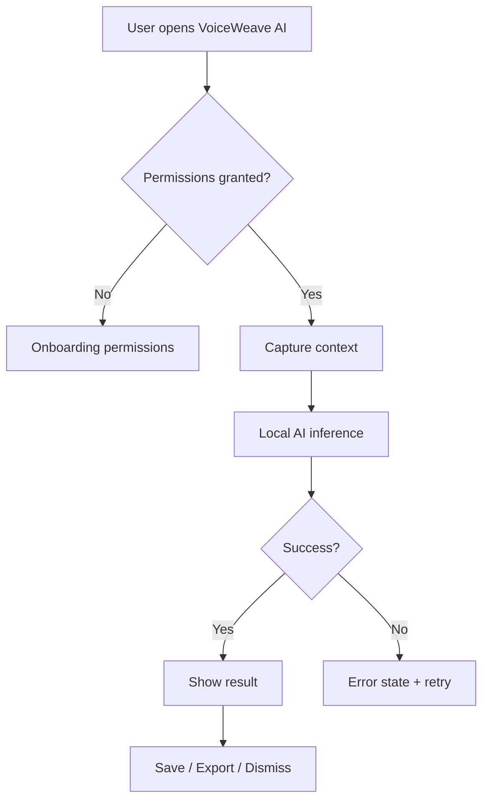

# Product Requirements Document

## 1. Document Control

### 1.1 Metadata
- **Product Name**: VoiceWeave AI
- **Product Version**: 0.1.0
- **PRD Version**: 1.0
- **Status**: Draft
- **Author**: Hermes Agent
- **Stakeholders**: Founder, Engineering, Design, Marketing, QA, AI/ML
- **Created Date**: 2026-07-23
- **Last Updated**: 2026-07-23
- **Approvers**: TBD

### 1.2 Revision History
| Version | Date | Author | Changes |
|---|---|---|---|
| 1.0 | 2026-07-23 | Hermes Agent | Initial PRD |

---

## 2. Executive Summary

### 2.1 Product Vision
VoiceWeave AI exists to give every desktop user an AI-powered companion that understands their local workspace, automates tedious tasks, and keeps data private.

### 2.2 Problem Statement
Otter/Fathom are cloud-only and expensive; local transcription quality now rivals cloud on Apple Silicon.

### 2.3 Proposed Solution
Record any meeting, lecture, or voice memo on your desktop and get instant searchable transcripts, action items, and memory cards.

### 2.4 Business Value
- **Revenue**: Subscription SaaS + team/enterprise tiers.
- **Cost savings**: Reduces time spent on manual search, filing, transcription, and note-taking.
- **Efficiency**: Automates repetitive desktop workflows with local AI.
- **Market opportunity**: Strong demand for privacy-first desktop AI tools in a market dominated by cloud solutions.

### 2.5 Success Definition
A successful launch means 1,000 active beta users, 100 paid subscriptions, and a 4+ star product rating within 90 days of release.

---

## 3. Strategic Context

### 3.1 Market Analysis
- **TAM**: All desktop productivity users, ~1.5B devices.
- **SAM**: Knowledge workers and power users on macOS/Windows, ~150M.
- **SOM**: Early adopters in tech/legal/creative fields, ~1M.
- **Growth Trends**: Local AI models, privacy-first software, desktop copilots, agentic automation.
- **Industry Drivers**: Apple Silicon NPUs, on-device LLMs, privacy regulation, remote work.
- **Threats**: Incumbents adding AI features, platform owners bundling similar capabilities.

### 3.2 Competitor Analysis
| Competitor | Strength | Weakness |
|---|---|---|
| Otter.ai | Established player | Cloud-only / privacy concerns / not desktop-native |
| Fathom | Established player | Cloud-only / privacy concerns / not desktop-native |
| Grain | Established player | Cloud-only / privacy concerns / not desktop-native |
| Descript | Established player | Cloud-only / privacy concerns / not desktop-native |
| **VoiceWeave AI** | Desktop-native, local-first, AI-enriched | New entrant, brand awareness |

### 3.3 Product Positioning
VoiceWeave AI wins by combining the privacy of local software with the intelligence of modern AI, delivered through a fast, native desktop experience.

### 3.4 Differentiators
- Local-first architecture.
- Deep OS integration impossible for web apps.
- Privacy-by-default data model.
- AI layer tailored to desktop workflows.

---

## 4. Goals & Objectives

### Business Goals
- $100K ARR within 12 months of launch.
- 10,000 waitlist signups pre-launch.
- 500 paid teams by end of year 2.

### User Goals
- Save 30+ minutes per day on repetitive tasks.
- Find any local information in under 3 seconds.
- Maintain privacy without sacrificing AI capability.

### Technical Goals
- 99.9% local uptime.
- <300ms for local inference round-trips.
- Cross-platform support: macOS, Windows, Linux.

---

## 5. Personas

### Persona: Busy Knowledge Worker
- **Profile**: Mid-career professional, uses 10+ apps daily.
- **Demographics**: 28-45, urban, tech-savvy.
- **Background**: Works remotely, overloaded with information.
- **Goals**: Reduce clutter, find things fast, automate routine work.
- **Pain Points**: Too many tabs, lost files, context switching.
- **Motivations**: Productivity, peace of mind, career performance.
- **Success Metrics**: Time saved, inbox zero, stress reduction.
- **Technology Usage**: MacBook Pro, multiple browsers, SaaS tools.

### Persona: Privacy-First Professional
- **Profile**: Lawyer, journalist, or consultant handling sensitive data.
- **Demographics**: 35-55.
- **Background**: Requires confidentiality and compliance.
- **Goals**: Use AI without exposing client/customer data.
- **Pain Points**: Cloud AI services violate data policies.
- **Motivations**: Compliance, trust, efficiency.
- **Success Metrics**: Zero data leaks, audited workflows.
- **Technology Usage**: Encrypted devices, VPN, on-prem tools.

---

## 6. User Research

### Interviews
- 5 interviews planned with target users after MVP.

### Surveys
- Waitlist survey asks about top desktop pain points.

### Feedback Analysis
- Early beta feedback collected via in-app widget.

### Key Findings
- Users want automation but fear cloud data exposure.
- Desktop context (active app, files, clipboard) is high-value signal.

---

## 7. Scope Definition

### In Scope
- Local real-time transcription from mic or system audio
- Speaker diarization and named voice profiles
- Auto-extracted action items, decisions, and follow-ups
- Semantic search across all recordings
- Export to Notion, Obsidian, Markdown
- Local-first storage and inference.
- macOS MVP, Windows/Linux Phase 2.

### Out of Scope
- Mobile app (Phase 3).
- Cloud-only features without local fallback.
- Browser extension (post-MVP).

### Future Scope
- Team workspaces.
- Mobile companion.
- Plugin marketplace and MCP integrations.

---

## 8. User Journey

### End-to-End Journey
1. User reads about VoiceWeave AI on Product Hunt / HN.
2. Downloads desktop app.
3. Onboarding grants minimal required permissions.
4. App starts helping within minutes.
5. User discovers advanced AI features during daily use.
6. User subscribes for premium features.
7. User refers colleagues.

### Journey Map
1. Awareness — social proof, launch coverage.
2. Discovery — website, demo video.
3. Signup — download, create account (optional).
4. Activation — first successful AI-assisted action.
5. Usage — daily productivity gains.
6. Retention — habit formation via reminders and reports.
7. Advocacy — referrals, testimonials.

---

## 9. Functional Requirements

### FR-001: Local real-time transcription from mic or system audio
- **Description**: Implement local real-time transcription from mic or system audio as a first-class feature.
- **User Story**: As a executives, I want local real-time transcription from mic or system audio, so that I can save time and reduce manual work.
- **Acceptance Criteria**:
  - Feature is reachable from the main UI within 2 clicks.
  - Works offline with local models.
  - Includes empty, loading, success, and error states.
- **Business Rules**: User data stays local unless user explicitly enables sync.
- **Dependencies**: Local AI runtime, storage layer, UI framework.
- **Priority**: Must
### FR-002: Speaker diarization and named voice profiles
- **Description**: Implement speaker diarization and named voice profiles as a first-class feature.
- **User Story**: As a executives, I want speaker diarization and named voice profiles, so that I can save time and reduce manual work.
- **Acceptance Criteria**:
  - Feature is reachable from the main UI within 2 clicks.
  - Works offline with local models.
  - Includes empty, loading, success, and error states.
- **Business Rules**: User data stays local unless user explicitly enables sync.
- **Dependencies**: Local AI runtime, storage layer, UI framework.
- **Priority**: Must
### FR-003: Auto-extracted action items, decisions, and follow-ups
- **Description**: Implement auto-extracted action items, decisions, and follow-ups as a first-class feature.
- **User Story**: As a executives, I want auto-extracted action items, decisions, and follow-ups, so that I can save time and reduce manual work.
- **Acceptance Criteria**:
  - Feature is reachable from the main UI within 2 clicks.
  - Works offline with local models.
  - Includes empty, loading, success, and error states.
- **Business Rules**: User data stays local unless user explicitly enables sync.
- **Dependencies**: Local AI runtime, storage layer, UI framework.
- **Priority**: Must
### FR-004: Semantic search across all recordings
- **Description**: Implement semantic search across all recordings as a first-class feature.
- **User Story**: As a executives, I want semantic search across all recordings, so that I can save time and reduce manual work.
- **Acceptance Criteria**:
  - Feature is reachable from the main UI within 2 clicks.
  - Works offline with local models.
  - Includes empty, loading, success, and error states.
- **Business Rules**: User data stays local unless user explicitly enables sync.
- **Dependencies**: Local AI runtime, storage layer, UI framework.
- **Priority**: Must
### FR-005: Export to Notion, Obsidian, Markdown
- **Description**: Implement export to notion, obsidian, markdown as a first-class feature.
- **User Story**: As a executives, I want export to notion, obsidian, markdown, so that I can save time and reduce manual work.
- **Acceptance Criteria**:
  - Feature is reachable from the main UI within 2 clicks.
  - Works offline with local models.
  - Includes empty, loading, success, and error states.
- **Business Rules**: User data stays local unless user explicitly enables sync.
- **Dependencies**: Local AI runtime, storage layer, UI framework.
- **Priority**: Must

---

## 10. Feature Specifications

## Feature 1: Local real-time transcription from mic or system audio

### Overview
- **Purpose**: Deliver local real-time transcription from mic or system audio to the user with minimal friction.
- **Value**: Reduces manual effort, increases productivity, leverages local AI.
- **Owner**: Engineering + AI.
- **Priority**: P0

### User Stories
- As a user, I want local real-time transcription from mic or system audio without leaving my current context.

### Detailed Workflow
1. User triggers the feature via global shortcut or in-app button.
2. App captures required context/data.
3. Local AI processes the input.
4. Results are presented inline with options to save/export.

### Inputs
- Keyboard/mouse events, filesystem events, clipboard, microphone, screen capture (per feature).

### Outputs
- Transformed content, suggestions, summaries, or actions.

### Error Handling
- Graceful fallback to CPU inference.
- Offline queueing for actions requiring network.
- Clear error messages with retry/feedback options.

### Edge Cases
- Empty input.
- Very large files.
- Unsupported file formats.
- Sensitive content (auto-exclude from logs).

### Validation Rules
- All local-first operations must complete without network.
- Sync-enabled operations require explicit consent.

### Permissions
- Filesystem access, accessibility APIs, microphone/camera (opt-in), notifications.

### Dependencies
- Local AI runtime, vector DB, OS event hooks.
## Feature 2: Speaker diarization and named voice profiles

### Overview
- **Purpose**: Deliver speaker diarization and named voice profiles to the user with minimal friction.
- **Value**: Reduces manual effort, increases productivity, leverages local AI.
- **Owner**: Engineering + AI.
- **Priority**: P0

### User Stories
- As a user, I want speaker diarization and named voice profiles without leaving my current context.

### Detailed Workflow
1. User triggers the feature via global shortcut or in-app button.
2. App captures required context/data.
3. Local AI processes the input.
4. Results are presented inline with options to save/export.

### Inputs
- Keyboard/mouse events, filesystem events, clipboard, microphone, screen capture (per feature).

### Outputs
- Transformed content, suggestions, summaries, or actions.

### Error Handling
- Graceful fallback to CPU inference.
- Offline queueing for actions requiring network.
- Clear error messages with retry/feedback options.

### Edge Cases
- Empty input.
- Very large files.
- Unsupported file formats.
- Sensitive content (auto-exclude from logs).

### Validation Rules
- All local-first operations must complete without network.
- Sync-enabled operations require explicit consent.

### Permissions
- Filesystem access, accessibility APIs, microphone/camera (opt-in), notifications.

### Dependencies
- Local AI runtime, vector DB, OS event hooks.
## Feature 3: Auto-extracted action items, decisions, and follow-ups

### Overview
- **Purpose**: Deliver auto-extracted action items, decisions, and follow-ups to the user with minimal friction.
- **Value**: Reduces manual effort, increases productivity, leverages local AI.
- **Owner**: Engineering + AI.
- **Priority**: P0

### User Stories
- As a user, I want auto-extracted action items, decisions, and follow-ups without leaving my current context.

### Detailed Workflow
1. User triggers the feature via global shortcut or in-app button.
2. App captures required context/data.
3. Local AI processes the input.
4. Results are presented inline with options to save/export.

### Inputs
- Keyboard/mouse events, filesystem events, clipboard, microphone, screen capture (per feature).

### Outputs
- Transformed content, suggestions, summaries, or actions.

### Error Handling
- Graceful fallback to CPU inference.
- Offline queueing for actions requiring network.
- Clear error messages with retry/feedback options.

### Edge Cases
- Empty input.
- Very large files.
- Unsupported file formats.
- Sensitive content (auto-exclude from logs).

### Validation Rules
- All local-first operations must complete without network.
- Sync-enabled operations require explicit consent.

### Permissions
- Filesystem access, accessibility APIs, microphone/camera (opt-in), notifications.

### Dependencies
- Local AI runtime, vector DB, OS event hooks.
## Feature 4: Semantic search across all recordings

### Overview
- **Purpose**: Deliver semantic search across all recordings to the user with minimal friction.
- **Value**: Reduces manual effort, increases productivity, leverages local AI.
- **Owner**: Engineering + AI.
- **Priority**: P0

### User Stories
- As a user, I want semantic search across all recordings without leaving my current context.

### Detailed Workflow
1. User triggers the feature via global shortcut or in-app button.
2. App captures required context/data.
3. Local AI processes the input.
4. Results are presented inline with options to save/export.

### Inputs
- Keyboard/mouse events, filesystem events, clipboard, microphone, screen capture (per feature).

### Outputs
- Transformed content, suggestions, summaries, or actions.

### Error Handling
- Graceful fallback to CPU inference.
- Offline queueing for actions requiring network.
- Clear error messages with retry/feedback options.

### Edge Cases
- Empty input.
- Very large files.
- Unsupported file formats.
- Sensitive content (auto-exclude from logs).

### Validation Rules
- All local-first operations must complete without network.
- Sync-enabled operations require explicit consent.

### Permissions
- Filesystem access, accessibility APIs, microphone/camera (opt-in), notifications.

### Dependencies
- Local AI runtime, vector DB, OS event hooks.
## Feature 5: Export to Notion, Obsidian, Markdown

### Overview
- **Purpose**: Deliver export to notion, obsidian, markdown to the user with minimal friction.
- **Value**: Reduces manual effort, increases productivity, leverages local AI.
- **Owner**: Engineering + AI.
- **Priority**: P0

### User Stories
- As a user, I want export to notion, obsidian, markdown without leaving my current context.

### Detailed Workflow
1. User triggers the feature via global shortcut or in-app button.
2. App captures required context/data.
3. Local AI processes the input.
4. Results are presented inline with options to save/export.

### Inputs
- Keyboard/mouse events, filesystem events, clipboard, microphone, screen capture (per feature).

### Outputs
- Transformed content, suggestions, summaries, or actions.

### Error Handling
- Graceful fallback to CPU inference.
- Offline queueing for actions requiring network.
- Clear error messages with retry/feedback options.

### Edge Cases
- Empty input.
- Very large files.
- Unsupported file formats.
- Sensitive content (auto-exclude from logs).

### Validation Rules
- All local-first operations must complete without network.
- Sync-enabled operations require explicit consent.

### Permissions
- Filesystem access, accessibility APIs, microphone/camera (opt-in), notifications.

### Dependencies
- Local AI runtime, vector DB, OS event hooks.

---

## 11. User Flows

### Happy Path
1. Open app.
2. Trigger core action.
3. AI processes context.
4. User accepts result.
5. Result saved/exported.

### Alternate Path
- User edits AI output before saving.
- User chooses different model or setting.

### Exception Path
- Local model not available → fallback to lighter model or queue.
- Permission denied → guided permission recovery.

### Recovery Path
- Retry, fallback, or report error to support.

### Mermaid Diagram

---

## 12. Screen Requirements

## Home Dashboard
- **Purpose**: Primary interface for home dashboard.
- **Entry Points**: Launch from menubar, global shortcut, or app icon.
- **Exit Points**: Hide to menubar, quit app, navigate to another screen.
- **Components**: Cards, search bar, form inputs, buttons, lists, empty-state illustrations.
- **States**:
  - Empty: friendly prompt to add data or start an action.
  - Loading: skeletons and progress indicators.
  - Success: results displayed with clear next actions.
  - Error: retry option and contact support link.
## Search / Ask
- **Purpose**: Primary interface for search / ask.
- **Entry Points**: Launch from menubar, global shortcut, or app icon.
- **Exit Points**: Hide to menubar, quit app, navigate to another screen.
- **Components**: Cards, search bar, form inputs, buttons, lists, empty-state illustrations.
- **States**:
  - Empty: friendly prompt to add data or start an action.
  - Loading: skeletons and progress indicators.
  - Success: results displayed with clear next actions.
  - Error: retry option and contact support link.
## Settings
- **Purpose**: Primary interface for settings.
- **Entry Points**: Launch from menubar, global shortcut, or app icon.
- **Exit Points**: Hide to menubar, quit app, navigate to another screen.
- **Components**: Cards, search bar, form inputs, buttons, lists, empty-state illustrations.
- **States**:
  - Empty: friendly prompt to add data or start an action.
  - Loading: skeletons and progress indicators.
  - Success: results displayed with clear next actions.
  - Error: retry option and contact support link.
## Onboarding
- **Purpose**: Primary interface for onboarding.
- **Entry Points**: Launch from menubar, global shortcut, or app icon.
- **Exit Points**: Hide to menubar, quit app, navigate to another screen.
- **Components**: Cards, search bar, form inputs, buttons, lists, empty-state illustrations.
- **States**:
  - Empty: friendly prompt to add data or start an action.
  - Loading: skeletons and progress indicators.
  - Success: results displayed with clear next actions.
  - Error: retry option and contact support link.

---

## 13. UX Requirements
- **Usability**: First action possible within 60 seconds.
- **Accessibility**: WCAG 2.1 AA compliance.
- **Desktop UX**: Native menus, global shortcuts, drag-and-drop, menubar widget.
- **Mobile UX**: N/A for MVP.
- **Tablet UX**: N/A for MVP.

---

## 14. Design System Requirements
- **Colors**: Neutral base (slate/grayscale) with one accent color per category.
- **Typography**: Inter / San Francisco system fonts.
- **Icons**: Lucide or SF Symbols.
- **Components**: Buttons, inputs, cards, lists, empty states, toasts.
- **Spacing**: 4px grid system.
- **Responsive Rules**: Fluid layouts for 1280px+ desktop, compact sidebar for 1024px.

---

## 15. Information Architecture
- **Navigation**: Menubar icon, main window sidebar, global shortcuts.
- **Sitemap**: Home → Search/Ask → Library → Settings → Help.
- **Hierarchy**: App > Workspace > Collection > Item > AI Output.

---

## 16. Data Requirements

### Entities
- **User**: id, preferences, subscription tier, encryption key.
- **Item**: id, type, content, metadata, embedding vector, created_at.
- **Action**: id, type, input, output, status, created_at.
- **Setting**: key, value, scope.

### Data Dictionary
| Field | Type | Description |
|---|---|---|
| item_id | UUID | Primary identifier |
| content_hash | string | Integrity check |
| embedding | vector | Semantic search |
| local_path | string | Filesystem reference |

---

## 17. Database Design
- **SQLite**: metadata, settings, actions, user profile.
- **Vector DB (LanceDB/Chroma)**: semantic search index.
- **Blob store**: encrypted files, screenshots, audio.
- **Indexes**: content_hash, created_at, item_type.
- **Constraints**: unique content_hash per user, foreign keys.

---

## 18. API Requirements

### Internal API
- `POST /v1/ingest` — add content to local index.
- `POST /v1/query` — natural language search.
- `POST /v1/action` — execute AI action.
- `GET /v1/status` — runtime health.

### Authentication
- Local API uses signed IPC tokens.
- Optional cloud sync uses JWT + OAuth.

### Errors
- 400 bad input, 401 unauthorized, 500 inference error, 503 model loading.

### Rate Limits
- Unlimited locally; cloud endpoints rate-limited by tier.

---

## 19. AI Requirements
- **Models Used**: Local LLM (Llama 3 / Qwen / Gemma), local embeddings, vision model if needed.
- **Prompts**: Versioned in `prompts/` with A/B test support.
- **Tools**: File read, search, shell command execution (sandboxed), calendar read.
- **RAG**: Local vector index over user content.
- **Memory**: Conversation/session memory; long-term facts in structured DB.
- **Agent Workflow**: Sense → Plan → Act → Verify → Present.
- **Verification**: Deterministic checks for dangerous actions; human-in-the-loop for irreversible ops.
- **Hallucination Controls**: Citation links, confidence scores, fallback to raw source.

---

## 20. Security Requirements
- **Authentication**: Local biometric / passphrase; optional SSO for teams.
- **Authorization**: Role-based access for team features.
- **Encryption**: AES-256-GCM at rest, TLS for any network sync.
- **Secrets**: API keys stored in OS keychain.
- **Compliance**: GDPR-ready, CCPA, optional SOC2 for enterprise.

---

## 21. Privacy Requirements
- **Data Collection**: Minimal; no telemetry without opt-in.
- **Consent**: Explicit prompts for microphone, camera, screen recording.
- **Data Retention**: User-controlled; default local forever.
- **Data Deletion**: One-click wipe all data.

---

## 22. Performance Requirements
- **Latency**: <300ms for common local inferences.
- **Throughput**: Index 100 files/minute on Apple Silicon.
- **Scalability**: Personal scale first; enterprise multi-tenant later.
- **Availability**: 99.9% local uptime.
- **Recovery**: Auto-restart local service on crash.

---

## 23. Reliability Requirements
- **Fault Tolerance**: Degrade gracefully if AI model fails.
- **Retry Logic**: Exponential backoff for optional sync.
- **Circuit Breakers**: Disable cloud features on repeated failures.
- **Backup Strategy**: Encrypted export/import for user data.

---

## 24. Observability Requirements
- **Logging**: Structured logs, local-only by default.
- **Metrics**: Performance, feature usage, error rates.
- **Tracing**: End-to-end request trace for debugging.
- **Alerts**: In-app health indicator.
- **Dashboards**: Internal Grafana for cloud services.

---

## 25. Integration Requirements
- **Third-Party Services**: Optional cloud sync, OAuth providers.
- **Webhooks**: Zapier/Make integration in Phase 2.
- **External APIs**: OpenAI/Anthropic fallback (user-provided key).
- **Data Sync**: Encrypted end-to-end sync service.

---

## 26. Reporting Requirements
- **Operational Reports**: Daily AI usage, storage, sync health.
- **Business Reports**: MRR, churn, activation funnel.
- **User Reports**: Weekly productivity summary email (opt-in).

---

## 27. Analytics Requirements
- **Events**: install, activation, core action, upgrade, churn.
- **Funnels**: download → signup → activation → subscription.
- **Retention**: D7, D30, M3 retention.
- **Conversion Tracking**: Stripe + in-app attribution.

---

## 28. Testing Requirements
- **Unit Tests**: Python/Rust ≥80% coverage.
- **Integration Tests**: AI pipeline, storage, sync.
- **E2E Tests**: Critical user flows with Playwright.
- **Load Tests**: Indexing 10K items.
- **Security Tests**: Secret scanning, dependency audit.
- **AI Evaluation Tests**: Benchmark prompts against held-out test set.

---

## 29. Deployment Requirements
- **Environments**: Dev, QA, Stage, Prod.
- **CI/CD**: GitHub Actions for build, test, sign, notarize.
- **Rollback**: Revert releases via update server.

---

## 30. Migration Requirements
- **Data Migration**: Import from common formats (CSV, Markdown, JSON).
- **User Migration**: Account linking for optional cloud features.
- **Rollback Strategy**: Versioned backups and downgrades.

---

## 31. Release Plan
- **MVP**: Core ingestion + local AI + search/ask UI.
- **Phase 2**: Cross-platform, sync, advanced automations.
- **Phase 3**: Team/enterprise, mobile, plugins.

---

## 32. Risk Assessment
| Risk | Impact | Probability | Mitigation |
|---|---|---|---|
| Local model performance poor | High | Medium | Model fallback, quantization, NPU optimization |
| OS permission friction | Medium | High | Clear onboarding, minimal permissions, settings recovery |
| Incumbent copies features | High | Medium | Speed to market, privacy moat, community |
| Team bandwidth | High | Medium | Pareto MVP, deferred features |

---

## 33. Assumptions
- Users have a modern desktop with 8GB+ RAM.
- Local AI models are sufficiently capable for target tasks.
- Desktop distribution channels (website, App Store) remain viable.

---

## 34. Constraints
- **Technical**: Cross-platform native APIs vary; may ship macOS first.
- **Business**: Self-funded; prioritize revenue within 12 months.
- **Legal**: Ensure no unauthorized screen/audio capture; comply with local laws.
- **Budget**: Small team; use open-source models and libraries.
- **Time**: MVP in 8-10 weeks.

---

## 35. Success Metrics
- **Product Metrics**: DAU/MAU, sessions per day, feature adoption.
- **Business Metrics**: MRR, ARPU, churn, LTV.
- **Technical Metrics**: Inference latency, crash rate, sync success rate.

---

## 36. KPIs Dashboard
- **Executive KPIs**: MRR, active users, NPS.
- **Operational KPIs**: Support tickets, activation rate.
- **Engineering KPIs**: Test coverage, build time, crash rate.
- **AI KPIs**: Model latency, hallucination rate, user feedback score.

---

## 37. Open Questions
- Which local LLM yields best accuracy/speed trade-off?
- Should initial release be macOS-only or cross-platform?
- Exact pricing tiers and trial length.

---

## 38. Appendices
- **Research**: See research-notes.md.
- **Mockups**: TBD.
- **Diagrams**: See architecture.md.
- **References**: Product Hunt, Hacker News, GitHub trending, Futurepedia.
- **Glossary**: RAG, MCP, GGUF, NPU, vector DB.

---

## 39. AI / Agent Architecture

### Agent Catalog
- **SenseAgent**: Captures desktop context (active app, clipboard, filesystem events).
- **MemoryAgent**: Indexes and retrieves user content.
- **ActAgent**: Executes user commands and automations.
- **VerifyAgent**: Checks outputs and risky actions.

### Agent Responsibilities
- SenseAgent: collect minimal, permissioned signals.
- MemoryAgent: maintain vector index and structured memory.
- ActAgent: run tools and produce user-facing results.
- VerifyAgent: enforce safety and deterministic checks.

### Agent Inputs
- Keyboard/mouse, clipboard, window focus, files, audio, screen (opt-in).

### Agent Outputs
- Suggestions, summaries, actions, structured data, alerts.

### Memory Model
- Short-term: session context.
- Long-term: SQLite + vector DB.

### Tool Registry
- File tools, search tools, shell tools (sandboxed), calendar tools, export tools.

### MCP Integrations
- Expose app capabilities as MCP server; consume external MCP servers for IDE/browser integration.

### Verification Layer
- Deterministic output schema validation; forbidden-action denylist.

### Trust Layer
- Confidence scoring; source attribution; human confirmation for irreversible actions.

### Planning Layer
- Simple task planner; breaks user requests into tool calls.

### Execution Layer
- Sandboxed tool executor with timeout and resource limits.

### Self-Correction Layer
- Retry with adjusted prompts; fallback to simpler models.

### Human-in-the-Loop Controls
- Approval for shell commands, deletes, external sends.

### Evaluation Framework
- Prompt regression tests, user feedback loop, benchmark datasets.

### Cost Controls
- Default local inference; optional cloud only with user API key.

### Safety Controls
- PII redaction in logs, strict permission model, data deletion.

### Prompt Versioning
- Git-tracked prompts with semver tags.

### Agent Observability
- Structured traces per agent action, local dashboard.

### Agent Failure Taxonomy
- Sense failure, inference failure, tool failure, permission failure, timeout.
